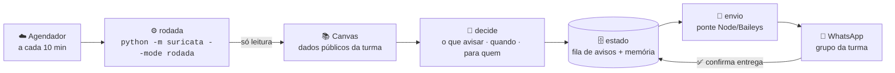
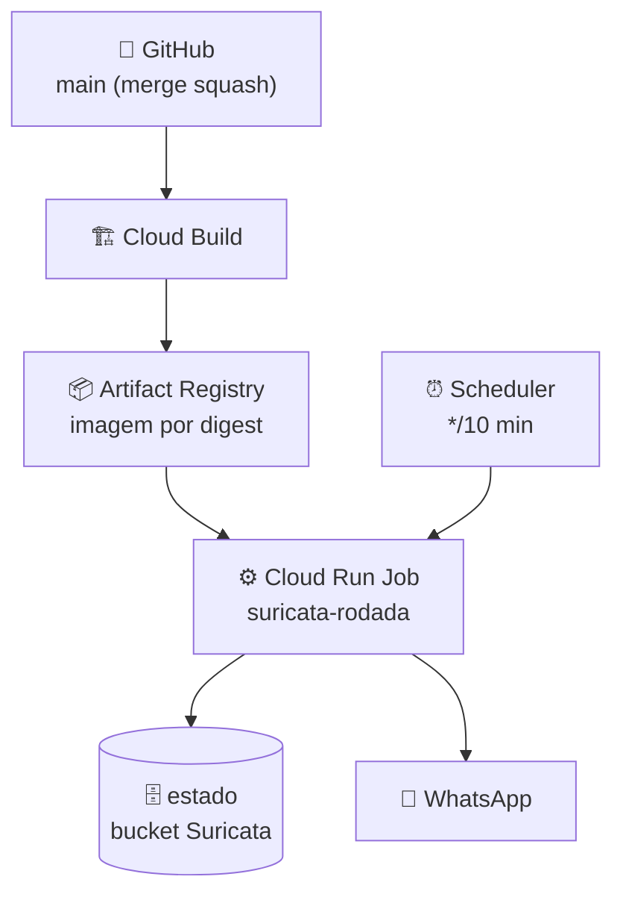

<div align="center">


**Avisos acadêmicos coletivos no WhatsApp** — o bot que acompanha o Canvas da turma e avisa o grupo na hora certa, sem nunca expor nada pessoal.

[](https://github.com/zC4sTr0/suricata-whatsapp/actions/workflows/suricata.yml)
[](LICENSE)
[](pyproject.toml)
[](ruff.toml)
[](pyproject.toml)
[](suricata/tests)

[Começar](#-quickstart) · [Como funciona](#-como-funciona) · [WhatsApp](#-sincronizando-com-o-whatsapp) · [Configuração](#%EF%B8%8F-configuração) · [Deploy](#-deploy-no-google-cloud) · [Trilha do estudante](#-trilha-do-estudante)

</div>

---

## ✨ O que é

A Suricata consulta **atividades públicas** do Canvas da turma (provas, listas, quizzes), identifica o que é novidade e avisa o grupo autorizado do WhatsApp **na hora certa**. Se o WhatsApp não confirma a entrega, o bot reenvia com o mesmo identificador — o grupo nunca vê aviso duplicado. E ele nunca publica notas, frequência ou qualquer situação individual.

## 🚀 Quickstart

```bash
git clone https://github.com/zC4sTr0/suricata-whatsapp && cd suricata-whatsapp
```

**1. Sem instalar nada** (Python 3.11+ puro, zero `pip install`):

```bash
python -m suricata --mode demo
```

Saída: as mensagens que *seriam* enviadas, com relatório completo — tudo offline, relógio congelado, entrega desligada. É o bot inteiro funcionando na sua máquina em segundos.

**2. Suíte completa** (o outro comando é só a ponte Node):

```bash
npm ci --prefix suricata/whatsapp --ignore-scripts
python -m pytest -q
```

**3. Um comando que valida tudo** (ambiente + matriz inteira):

```bash
python scripts/bootstrap.py
```

## 🧠 Como funciona

O coração do bot é a **rodada**: uma volta completa do ciclo de avisos. A cada **10 minutos** (em produção, via agendador do Google Cloud), a rodada acorda, dá uma olhada no Canvas da turma, descobre o que é novidade (prova marcada, lista liberada, quiz abrindo), decide **se vale avisar e quando** — e grava tudo num estado durável antes de qualquer envio. Só depois de tudo conferido a mensagem sai, e ela só conta como enviada quando o **WhatsApp confirma a entrega**.



### ⏰ Quando ele roda?

- A rodada **acorda a cada 10 minutos, todos os dias — inclusive fim de semana e feriado** (vai ao Canvas, prepara tudo).
- Os avisos, porém, só saem nas **janelas da manhã** (07:00), **meio-dia** (12:00) e **véspera** (18:00, para o que vence no dia seguinte). Entre 23:00 e 07:00 é **silêncio total**.
- O **calendário letivo é respeitado**: véspera não dispara para fim de semana ou feriado (só para dia de aula), e qualquer mensagem é cortada a partir das 21:00 da noite.
- Resumo: a máquina roda 24/7, mas **mensagem no grupo só na hora certa, para o dia de aula certo**.

### 🛡️ Por que ele nunca manda besteira

| Garantia | Como |
|---|---|
| **Nada sai por acidente** | Sem configuração, estado ou confirmação → nada é enviado. O envio precisa estar **expressamente ligado** |
| **Nunca duplica aviso** | Cada aviso espera a **confirmação do WhatsApp**; se ela não vier, o aviso volta para a fila e reenvia com o mesmo identificador — o grupo vê 1 vez |
| **Só fala o que é coletivo** | Olha apenas dados públicos do Canvas; notas, faltas e situações individuais nunca chegam perto do texto |

## 💬 Sincronizando com o WhatsApp

A sessão do WhatsApp vive **fora do repo** (nunca versionada, nunca na imagem):

1. **Parear** (operação humana, terminal local): `node suricata/whatsapp/parear.mjs --auth-dir <diretório-fora-do-repo>` — leia [`suricata/whatsapp/README.md`](suricata/whatsapp/README.md) para o fluxo completo.
2. A ponte Node usa `SURICATA_WA_AUTH_DIR` para encontrar a sessão em produção (materializada do GCS via CAS, nunca copiada).
3. Confirme o JID do grupo antes de qualquer entrega real.

O detalhamento de cada etapa está no [guia](docs/guia.md).

## ⚙️ Configuração

Tudo por variáveis de ambiente — veja [`.env.example`](.env.example) comentado. O essencial do modo `rodada`:

| Variável | Obrigatória | O que faz |
|---|---|---|
| `SURICATA_CANVAS_TOKEN` | ✅ | token de acesso à API do Canvas (nunca no repo) |
| `SURICATA_ESTADO_URI` | ✅ | estado da rodada: **diretório local** ou `gs://…` |
| `SURICATA_ENTREGA` | — | `ligada` habilita envio; **default: desligada** |
| `SURICATA_GRUPO_JID` | — | JID do grupo destino (`…@g.us`) |
| `SURICATA_DESTINOS_JSON` | — | múltiplos destinos com janela própria |

<details>
<summary><b>Todas as variáveis</b> (lease, auth, destinos)</summary>

Ver [`.env.example`](.env.example) — cada linha documenta obrigatória/opcional, valor de exemplo seguro e quando importa. A referência completa de semânticas está em [`docs/interno/CONFIGURATION.md`](docs/interno/CONFIGURATION.md).
</details>

## ☁️ Deploy no Google Cloud

Produção = **um** Cloud Run Job (`suricata-rodada`) acionado por **um** Scheduler (`suricata-rodada-10min`), imagem por digest no Artifact Registry, estado em GCS — região `southamerica-east1`. Nada de segundo Scheduler, jamais.



O passo a passo completo (build, canário sem entrega, corte controlado, rollback por digest) está em [`docs/deploy-gcp.md`](docs/deploy-gcp.md).

**Pré-requisitos para mexer no deploy:** só o **`gcloud` CLI** (Google Cloud SDK) — o build da imagem acontece remotamente no Cloud Build, então **Docker local é opcional** (só se quiser testar a imagem na sua máquina). Instalação: [`docs/deploy-gcp.md`](docs/deploy-gcp.md) §Pré-requisitos.

> **Nota:** os últimos commits desta `main` (modernização + padronização) ainda **não foram deployados** — a imagem de produção é de um snapshot anterior. Deploy é um passo que custa (Cloud Build) e exige autorização expressa; o procedimento está documentado e testado.

## 📣 Quero avisar algo que não está no Canvas

Prova marcada em aula, material postado fora do sistema, prazo que só você sabe: publique na **agenda manual** e o bot anuncia no grupo na janela certa, igual aos avisos do Canvas.

```bash
# 1. escreva um arquivo com o item (id único por item; data AAAA-MM-DD ou null)
# 2. veja o que seria publicado, sem publicar nada:
python deploy/publicar_agenda.py --arquivo minha-agenda.json --dry-run
# 3. publique (vai para o estado que a rodada lê):
python deploy/publicar_agenda.py --arquivo minha-agenda.json
```

Formato completo, exemplo pronto e regras (id único, tipos aceitos) em [`docs/guia.md`](docs/guia.md) — seção "Publicando itens manuais na agenda". Publicar duas vezes o mesmo `id` não duplica aviso.

## 🎓 Trilha do estudante

Progressiva, do zero ao domínio — cada nível diz o que você vê, o que isso prova e o próximo passo:

| Nível | Comando | Prova |
|---|---|---|
| 1 · testes verdes | `python -m pytest -q` | contratos congelados |
| 2 · probe | `python -m suricata --mode shadow` | pacote e entrypoint íntegros |
| 3 · rodada offline | `python -m suricata --mode demo` | o pipeline inteiro, sem efeitos |
| 4 · produção local | `SURICATA_ESTADO_URI=./tmp … --mode rodada` | estado real, entrega desligada |

Guia completo em [`docs/guia.md`](docs/guia.md).

## 🧰 Desenvolvimento

```text
suricata/
├── rodada/      orquestração (execucao, runtime, coleta, agenda_manual, config)
├── dominio/     regras puras (planejamento, publico, corte, memoria, lotes, relatorio)
├── integracao/  adaptadores (canvas, bridge)
├── storage/     persistência e concorrência (outbox, lease, CAS, GCS/local)
├── whatsapp/    ponte Node (Baileys)
└── tests/       suíte de contratos (pytest + unittest + node --test)
```

- **Matriz de validação** antes de qualquer PR: `python -m compileall -q suricata && python -m pytest -q && python -m unittest discover -s suricata/tests && node --test suricata/tests/*.mjs suricata/whatsapp/tests/*.mjs`
- **Lint**: `ruff check .` (config em [`ruff.toml`](ruff.toml))
- Como contribuir: [`CONTRIBUTING.md`](CONTRIBUTING.md) — fatias pequenas, teste de contrato antes do código, PR com provas.

## 📄 Licença

[MIT](LICENSE) — livre para estudar, usar e modificar.
