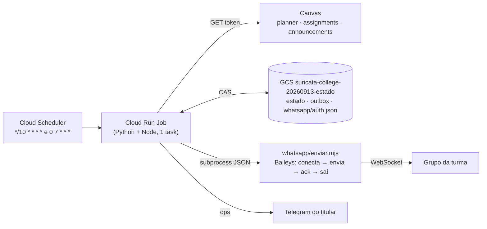

# Plano Suricata — alertas da turma no WhatsApp (Cloud Run, 24/7)

> **Frase de retomada:** quando o titular disser **"Suricata: releia o plano e retome."** — mesmo
> no meio de outra tarefa —, pare o que estiver fazendo num ponto seguro, abra este arquivo, rode a
> §R (retomada), corrija o registro de progresso para o estado real e continue do primeiro passo
> não concluído.
>
> Runbook executável por uma IA sem contexto. Escrito em 2026-09-13 a partir da auditoria do repo
> e das decisões do titular na mesma data. O porquê das regras gerais está no
> [plano mestre](PLANO-BOT-ACADEMICO.md); a infraestrutura Cloud Run já existente está em
> [`PLANO-NUVEM-CLOUD-RUN.md`](PLANO-NUVEM-CLOUD-RUN.md). **Para o grupo da turma, este plano vence.**

> **Emenda de isolamento — 2026-09-14:** este produto é separado do Bot acadêmico
> pessoal do Telegram. Antes de S1, a implementação deve ser migrada para a raiz
> `suricata/`, com Dockerfile, testes, estado, imagem, serviço/Jobs, schedulers,
> bucket, service accounts e secrets próprios. Não alterar nem compartilhar em
> runtime `scripts/academico/**`, `academico/estado/**`, o serviço `academico-controle`,
> os Jobs `academico-*`, os schedulers `diario-0700`/`sentinela-10min`, o bucket
> `gs://puc-bot-20260912-estado` ou os secrets `telegram-*`/`canvas-token` do Bot
> Telegram. O token Canvas poderá ser uma cópia autorizada em um secret Suricata
> próprio; o valor nunca deve ser lido, impresso ou versionado. Até a separação
> ser verificada, S1–S9 ficam bloqueadas e S0 ganha o passo S0.0-Isolamento.

---

## Registro de progresso

> **Vigência do registro:** esta tabela é um snapshot histórico de uma execução
> anterior. `✅` não significa que a árvore atual ou a nuvem foram revalidadas.
> Antes de agir, compare o SHA/`git status` atual e use o `RUNBOOK.md`; comandos
> de Jobs/Schedulers abaixo que não tenham read-back atual são históricos e não
> executáveis por cópia.

**Ao começar:** rode a §R. **Ao terminar cada passo:** atualize esta tabela (status, último passo,
data, evidência curta). Nunca marque ✅ sem a evidência pedida.

| Etapa | O quê | Status | Último passo | Data | Evidência |
|---|---|---|---|---|---|
| S0 | Runtime no `HEAD`, push, isolamento | ✅ | commits `01e4052`…`0254663` publicados | 2026-09-14 | `main` = `origin/main`; projeto próprio `suricata-college-20260913` |
| S1 | Latência: varredura sem planner, trava 6 min, 24/7 | ✅ | `rodada.py` | 2026-09-14 | coleta real: 9 ofertas, 31 atividades, ~6 s; Scheduler `*/10 * * * *` |
| S2 | Camada pública sem dado pessoal | ✅ | persona "Suricata" (D27) + véspera 18:00 (D26) + anúncios | 2026-09-14 | prévia com dados reais: véspera 14/09 lista a entrega de 15/09; 18 testes de rodada/véspera |
| S3 | Ponte WhatsApp e outbox sem `unknown` | ✅ | ACK pelo stanza do WebSocket; crash pós-ACK tolerado | 2026-09-14 | outbox: `sent 2`, rodada seguinte 0 reenvios |
| S4 | Pareamento e grupo | 🔄 | QR lido 2026-09-14 ~13:33; sessão só no bucket | 2026-09-14 | chip está só em **"teste bot"** (3 participantes). **H2 pendente:** chip entrar no grupo da turma |
| S5 | Medições WhatsApp | 🔄 | M-WA-01 ✅ (ACK status 2, ~63 s por conexão); **M-WA-02 ✅ (F42)** | 2026-09-14 | H3 feita pelo titular (print): teste enviado 4× e provas ~7× com o mesmo ID aparecem **1 vez** cada. M-WA-03 conta de 14/09 a 17/09 |
| S6 | Imagem, Job, Scheduler, sombra | ✅ | digest `sha256:7afd7228…d134` | 2026-09-14 | Job `suricata-rodada`; sombra `concluida` antes de ligar entrega |
| S7 | Linha de base e ativação | 🔄 | entrega ligada para **"teste bot"** | 2026-09-14 | 2 provas reais publicadas 13:55 detectadas e enviadas (atraso inflado pelos bugs corrigidos no mesmo dia) |
| S8 | Vigilância | 🔄 | alertas Cloud Monitoring por e-mail: "Suricata: rodada falhando" (≥ 2 execuções com falha em 20 min) e "Suricata: rodada parada" (nenhuma execução em 30 min) | 2026-09-14 | falta aviso "sem visão" no grupo e aviso de sessão caída no Telegram (D24) |
| S9 | Documentação | 🔄 | auditoria `docs/audits/suricata-auditoria-caminho-real-2026-09-14.md` | 2026-09-14 | — |

**Estado real (2026-09-14 14:10):** a Suricata roda sozinha no Cloud Run a cada 10 min, 24/7,
entregando no grupo **de teste**. O caminho de produção é `python -m suricata --mode rodada`
(`suricata/rodada.py`); `--mode sentinela` e os módulos `adapter`/`application`/`delivery`/`estado`
são legado não usado pela nuvem. Configuração do Job (só ambiente): `SURICATA_ESTADO_URI`,
`SURICATA_ENTREGA=ligada`, `SURICATA_GRUPO_JID` (destino legado "teste bot"),
`SURICATA_DESTINOS_JSON` (destinos adicionais), secret `SURICATA_CANVAS_TOKEN=suricata-canvas-token:1`.

**Destinos descobertos e configuração atual (verificado pela execução
`suricata-rodada-rkl8p`, modo `grupos`):** `teste bot` =
`120363413467147632@g.us`; `Trabalho interdisciplinar` =
`120363411246956882@g.us`; `Ciência de Dados e IA` =
`120363408899805839@g.us`. O Job mantém `teste bot` em
`SURICATA_GRUPO_JID` e envia também para `Trabalho interdisciplinar` por
`SURICATA_DESTINOS_JSON`, no mesmo Scheduler `*/10 * * * *` e no mesmo
fluxo de coleta, decisão, renderer, outbox e sessão. Memória, outbox e
relatório são namespaced por destino para evitar colisões.

Para descobrir novamente sem enviar mensagens, rode
`gcloud run jobs execute suricata-rodada --args=--mode,grupos` (projeto/região da Suricata) e leia
somente `jsonPayload.grupos`. Para substituir o destino legado, faça-o apenas com JID confirmado;
a configuração adicional deve usar `SURICATA_DESTINOS_JSON`.

**Sessão caída (`sessao: logged_out` no `grupo/ultima-rodada.json`):** abrir
`suricata/whatsapp/parear_terminal.mjs --auth-dir %TEMP%\suricata-pareamento\.wa-auth` numa janela
visível, o titular lê o QR, e subir a pasta para `whatsapp/auth.json` com CAS (roteiro na auditoria,
A14/A15). Nunca usar o `parear.mjs` antigo.

Legenda: ⏳ pendente · 🔄 em andamento · ✅ concluída · ⛔ bloqueada (motivo) · ⏭️ pulada pelo titular.

---

## §R. Retomada (rode sempre antes de agir)

1. `git status -sb && git log --oneline -5` — anote o que mudou desde a última evidência do registro.
2. Leia, nesta ordem: `AGENTS.md`; este arquivo inteiro; `docs/PLANO-BOT-ACADEMICO.md` §1, §5 e §7;
   **`docs/audits/suricata-auditoria-caminho-real-2026-09-14.md`** (a suíte verde não prova o produto:
   rode `python -m unittest suricata.tests.test_caminho_real_e2e` e registre a
   contagem/resultado real; não procure `expectedFailure` como gate vivo, pois
   os testes atuais não usam esse decorador. Nenhuma etapa S1–S9 fica ✅ sem
   evidência do artefato e do estado externo correspondente).
3. Estado real da nuvem (somente leitura; `G` = gcloud):
   ```bash
   G="/c/Users/C4sTr/AppData/Local/Google/Cloud SDK/google-cloud-sdk/bin/gcloud"
   "$G" scheduler jobs list --location southamerica-east1 --project puc-bot-20260912
   "$G" run jobs list --region southamerica-east1 --project puc-bot-20260912
   "$G" run jobs executions list --job academico-sentinela --region southamerica-east1 --limit 6
   "$G" storage ls gs://puc-bot-20260912-estado/ gs://puc-bot-20260912-estado/whatsapp/ 2>&1
   "$G" storage cat gs://puc-bot-20260912-estado/ultima-sentinela.json
   ```
4. Suíte: `python -m unittest discover -s scripts/academico/tests` (sem `PYTHONIOENCODING` exportado).
5. Compare a realidade com o registro. Se divergirem, **a realidade vence**: corrija a tabela (com a
   evidência do passo 3/4) antes de continuar. Se o registro diz ✅ e a nuvem contradiz, marque 🔄 e
   refaça a verificação da etapa.
6. Continue do primeiro passo não concluído. Se esta retomada interrompeu outra tarefa, registre em
   uma linha, no fim do report, o que ficou pendente dela.

---

## 1. Objetivo e contrato de serviço

A **Suricata** é um bot que só fala (não recebe comandos) num **grupo de WhatsApp da turma**,
usando o **token Canvas do titular** já registrado, rodando **só no Google Cloud Run**, 24 horas.

**SLA principal (inegociável):** um quiz ou prova que fica visível para o aluno às `T` é anunciado no
grupo até **`T + 20 min`**, desde que a janela ainda esteja aberta. Nenhuma mensagem é enviada a partir
de **21:00 BRT**. A única exceção é uma atividade nova, claramente marcada como prova, lista ou quiz,
que começa e termina no mesmo dia da descoberta; ela pode aguardar e sair às **07:00 BRT**.

Orçamento de latência que cumpre o SLA com folga para **uma** rodada perdida:

| Parcela | Valor |
|---|---|
| Intervalo do Scheduler | 10 min (`*/10 * * * *`, 24/7) |
| Início do job (medido) | ~12 s |
| Coleta Canvas (planner + varredura + anúncios) | alvo ≤ 30 s |
| Conexão WhatsApp + envio + confirmação do servidor | alvo ≤ 45 s |
| **Pior caso sem falha** | ~11,5 min |
| **Pior caso com 1 rodada perdida** | ~21,5 min → por isso a trava vence em 6 min e o job tem retry 1 |

Se medir que uma rodada normal passa de 90 s, pare e reporte: o SLA deixa de ser garantido.

## 2. Decisões do titular (2026-09-13) — não reabrir

| ID | Decisão | Consequência |
|---|---|---|
| D18 | WhatsApp **não oficial por QR code** (Baileys), num **chip dedicado** do titular. Risco de banimento aceito. | **Substitui D15.** API oficial da Meta fora de escopo. |
| D19 | Público = **grupo da turma**. Mensagens nunca trazem estado pessoal do titular (entrega, atraso, nota). | Camada `grupo` (S2). |
| D20 | Ofertas: **todas, exceto Espaço da Coordenação (104959)**; Mentoria de Carreira (289837) passou a ser coberta; oferta **sem nenhuma tarefa** na rodada também fica fora. | Regra dinâmica em `rodada.py`. |
| D21 | ~~**Madrugada também**~~ **substituída por D34**: alerta urgente sai na hora, 24/7. | Scheduler `*/10 * * * *`. |
| D22 | **Aviso incerto nunca pode existir**: todo evento do grupo termina `sent` (com confirmação do servidor) ou continua sendo reenviado até confirmar ou expirar. Nenhum estado `unknown` no canal WhatsApp. | Outbox com reenvio idempotente (S3). |
| D23 | **Não rotacionar o token Canvas.** Usar o `canvas-token` já registrado no Secret Manager. | MG-06 fica como risco aceito; não é gate. Não pedir rotação. |
| D24 | O Telegram do titular continua como está (alertas pessoais) **e** vira canal de operação (sessão caída, job parado, evento expirado). O grupo nunca recebe erro técnico, exceto o aviso de "sem visão" (S8). | — |
| D25 | Interação humana mínima: a IA **só entrega o QR code**; o resto é automático. Portões humanos permitidos: ler o QR (H1), colocar o chip no grupo da turma se ainda não estiver (H2), olhar o grupo de teste uma vez (H3). | — |
| D26 | (2026-09-14) **Sem mensagem das 07:00.** Resumo às **18:00 da véspera**, só quando amanhã é dia de aula (seg–sex, fora de feriado nacional por lei; Carnaval e Corpus Christi são ponto facultativo e **não** bloqueiam). Não envia se não houver nada amanhã nem nos 6 dias seguintes. | `rodada.planejar_vespera`, `publico.texto_vespera` |
| D27 | (2026-09-14) Persona **"Suricata"** (nome completo sempre; "Suri" foi recusado pelo titular): frases curtas e didáticas, 💡 só quando explica algo. Inferência declarada: abre e fecha no mesmo dia, ou só abre num dia, = "tudo indica que é nesse dia". | `publico.dia_provavel` |
| D28 | (2026-09-14) **Agenda anotada em aula** complementa o Canvas nos dois bots: `academico/agenda-manual.json` (nota pessoal) publicada por `python scripts/publicar_agenda_manual.py` no bucket de cada bot (sem deploy). Canvas vence; sem data não avisa; divergência de data só vai para o Telegram do titular. Suricata: véspera 18:00 e 'chegando'. Bot pessoal: aviso até 7 dias antes, no dia e divergência (dedup por item). | `suricata/agenda_manual.py`, `scripts/academico/agenda_manual.py` |
| D29 | (2026-09-14) Mensagens assinam **"🎓 *PUC Bot*"** (substitui a persona "Suricata" de D27; o produto e a infra continuam chamados Suricata). Toda linha de atividade traz o valor (`· 25 pts`, `· 1 pt`, `· 1,5 pts`), inclusive na véspera. | `publico.ASSINATURA`, `publico.pts` |
| D30 | (2026-09-14) ~~Sem lembrete minutos antes do quiz abrir~~ **substituída por D32** ("na hora não ajuda"). Avisos do grupo: publicação no Canvas (imediato, SLA 20 min), mudança de horário, anúncio do professor e véspera. | `rodada.planejar` |
| D31 | (2026-09-14) **Aviso extra às 12:00 da véspera só quando amanhã tem prova ou quiz** (dia de aula), além do resumo das 18:00. Janela 12:00–17:59, uma decisão por data. | `rodada.planejar_aviso_prova`, `publico.texto_aviso_prova` |
| D32 | (2026-09-14) **Lembrete ~15 min antes de um quiz já conhecido abrir** volta (titular). Uma vez por horário de abertura; não sai se o quiz foi publicado já dentro da janela (o aviso de publicação cobre). | `rodada.planejar`, `publico.precisa_lembrete` |
| D33 | (2026-09-14) **Só avisar o que é útil agora e surpresa.** Publicação no Canvas só se acontece/vence hoje, ou amanhã quando a véspera já passou ou não existe (quiz sem data nenhuma também). Mudança de horário só se a data nova ou antiga é hoje/amanhã. Recado do professor só se fala de prova/quiz e de hoje/amanhã. Véspera 18:00 em silêncio quando amanhã não tem nada; 'Chegando' cita cada prova uma vez; 18:00 não repete a prova do meio-dia; sem 'abre amanhã, vai até X', rodapés e dicas óbvias; lembrete só para quiz de janela ≤ 3 h; surpresas pendentes saem juntas (até 5 por mensagem). Simulação com dados reais: 4 mensagens em 14 dias. | `publico.decidir`, `publico.quando_importa`, `tests/test_discricao.py` |
| D34 | (2026-09-14) **Corte absoluto às 21:00:** nada é enviado de 21:00 a 06:59; véspera, aviso, mudança, anúncio, lembrete, pendência antiga e atividade futura expiram/são descartados no corte. Só uma novidade do Canvas, ausente da memória, claramente marcada como prova, lista ou quiz, com início e fim hoje e ainda aberta, pode aguardar até 07:00. Substitui D21. | `rodada._pode_aguardar_07h`, `rodada.entregar` |
| D35 | (2026-09-14) **Matéria pesada (Computabilidade) e leitura por matéria.** Mensagens de véspera e do meio-dia agrupadas por matéria (nome uma vez, itens embaixo; tipo no emoji: 📝 prova, ⚡ quiz, 📌 entrega, 🎯 no dia). Para `MATERIAS_PESADAS`: lista avisada às 18:00 **2 dias antes** do prazo e prova **3 dias antes**, em qualquer dia da semana, uma vez por item ('pra se adiantar'); lista sempre com a linha 📖 livro · capítulo · páginas · nº de exercícios extraída da descrição no Canvas (vazia se não seguir o padrão; nunca inventa). Simulação real: 5 mensagens em 14 dias. | `publico.montar_vespera`, `publico.resumo_estudo` |
| D36 | (2026-09-14) **O bot só constata, nunca dá ordens** (nada de 'reserve', 'comece', 'revise', 'esteja pronto'; trava em `tests/test_observacoes.py`). No lugar, até 2 observações factuais por item (`↳`), só quando o fato existe: colisão de provas/entregas no mesmo dia; prova na véspera/dia seguinte ou 3 dias seguidos; logo depois do fim de semana/feriado/feriadão (só enquanto a pausa não começou); última entrega antes da prova da mesma matéria; fecha de manhã. Em mensagens do dia seguinte, a colisão com item da mesma mensagem é omitida. | `publico.observar` |
| D37 | (2026-09-14) **Inferência e origem não viram texto:** sem "tudo indica que é amanhã", "💡 Tudo indica que é dd/mm" e "marcada em aula". A inferência (abre e fecha no mesmo dia = acontece nesse dia) continua decidindo em qual dia o item aparece; a linha mostra só título, pontos e horário. | `publico._linha_curta`, `tests/test_observacoes.py` |
| D38 | (2026-09-15) **Nada depois das 21:00:** o Scheduler continua acordando a cada 10 minutos, mas acordar não significa enviar. O bloqueio ocorre antes de reivindicar pendências e antes da ponte. A exceção matinal é fail-closed: exige novidade Canvas, ausência na memória, tipo `quiz`/`avaliacao` ou título inequívoco de lista/exercícios, `unlock_at` e fechamento no mesmo dia BRT da descoberta e fechamento ainda futuro. | `rodada.entregar`, `rodada._pode_aguardar_07h`, `tests/test_corte_21h.py` |

### 2.1 Contrato operacional do corte de 21h e previsão offline

O Scheduler continua com `*/10 * * * *`, inclusive à noite. **Acordar não é enviar.** Toda rodada deve
avaliar o corte em `America/Sao_Paulo` antes de reivindicar pendências (`claim`) e antes de chamar a ponte.

| Janela BRT | Comportamento do Scheduler | Mensagem externa |
|---|---|---|
| 07:00–20:59 | Coleta, planeja e entrega eventos elegíveis; ACK confirmado transforma o evento em `sent`. | Permitida conforme as demais regras. |
| 21:00–23:59 | Coleta e registra o relatório; descarta eventos comuns e pendências antigas. | **Proibida.** |
| 00:00–06:59 | Pode coletar, mas continua sem envio. Só preserva a exceção matinal fail-closed. | **Proibida.** |
| 07:00 seguinte | Reabre a entrega para exceções ainda `pending` e válidas. | Permitida uma vez, com o mesmo `message_id`. |

#### Exceção matinal

Uma novidade noturna só pode permanecer no outbox para 07:00 quando todos os predicados forem verdadeiros:

1. o evento é `novo`, não `mudou`, `anuncio`, `aviso_prova`, `vespera` ou `lembrete`;
2. a atividade veio do Canvas e não estava na memória anterior;
3. o tipo é `quiz` ou `avaliacao`, ou o título identifica inequivocamente `lista`/`exercício`;
4. `unlock_at` existe e cai no dia BRT da descoberta;
5. o fechamento (`lock_at` ou `due_at`) existe e cai no mesmo dia BRT;
6. o fechamento ainda é posterior ao instante da descoberta.

Se qualquer predicado falhar, o evento não atravessa 21h. Ausência de coleta válida ou de evidência da memória
anterior também é tratada como falha: o sistema não infere que algo “não existia ontem”.

#### Outbox, reenvio e ACK

- Antes de 21h, evento elegível vira `pending`, é reivindicado e só vira `sent` com confirmação válida.
- A partir de 21h, o bloqueio ocorre antes do `claim`; portanto pendência antiga não é reenviada à noite.
- Evento comum não é carregado artificialmente para a manhã; ele é descartado/expirado no corte.
- A exceção matinal recebe expiração técnica às 07:01 BRT: a janela começa às 07:00 e precisa permitir a reivindicação no instante exato da abertura.
- Às 07:00, a exceção pode ser reivindicada; sem ACK continua `pending` para a próxima rodada permitida,
  com o mesmo `message_id`, respeitando a expiração.

#### Simulação determinística sem envio

Para prever o comportamento sem produzir efeitos externos, os testes devem congelar:

- a fotografia de atividades/anúncios do Canvas;
- a memória do destino;
- o relógio em BRT;
- `entrega_ligada=False` e uma ponte ausente/falsa.

O simulador deve executar as rodadas de 10 em 10 minutos e imprimir, por data:

```text
data/hora BRT | eventos planejados | eventos entregáveis | motivo do silêncio | chamadas à ponte
```

O resultado esperado para um Canvas sem mudanças não é “uma mensagem por rodada”. É uma sequência finita:
mensagens de véspera/aviso que ainda não foram registradas, lembretes de horários conhecidos ainda não consumidos,
eventuais exceções matinais e, depois, `nenhuma mensagem nova` quando a memória já marcou cada evento. Se o
Canvas congelado não contiver informação suficiente para decidir uma data, a saída deve dizer `não determinável`
em vez de inventar uma mensagem.

**F42 (medido 2026-09-14, M-WA-02):** reenviar ao grupo com o mesmo `messageId` não duplica — o WhatsApp
mostra uma única mensagem com o horário do primeiro envio (teste 4×, provas ~7×, visto no celular).

## 3. Fatos que este plano usa

Medidos neste repo (tabela §5 do plano mestre): **F12** planner sem `unlock_at`; **F13** quiz aberto
15–20 min, criado 1,4 h–30 d antes; **F24** token Bearer funciona; **F37** planner omite todo
assignment sem `due_at` (os 3 que existem são quizzes).

Medidos em 2026-09-13 para este plano:

| ID | Fato | Uso |
|---|---|---|
| F38 | Assignments por oferta (token): 292184=11, 292185=6, 289812=1, 289818=3, 292189=3, 289835=3, 289852=1; **zero** em 289837 (Mentoria), 292200 (TI 7096100), 104959 (Coordenação), 256534 (Extensão). | Grupo começa com 7 ofertas; as de zero entram sozinhas quando ganharem a primeira tarefa. |
| F39 | Groups API oficial da Meta limita grupo a **8 participantes** (documentação Meta, lida em 09-13). | Justifica D18. |
| F40 | npm `@whiskeysockets/baileys`: `latest` = `7.0.0-rc14`, `legacy` = `6.7.24` (lido em 09-13). `sendMessage` aceita `{ messageId }`. | S3. Reconfira a versão no dia da execução e registre. |
| F41 | Sentinela no Cloud Run: rodada de ~15 s do início ao fim, 1–2 GETs, `concluida` (execuções de 09-13). | Orçamento §1. |

**Verificações pendentes (não trate como fato até medir em S5):**

| ID | O que medir | Bloqueia |
|---|---|---|
| M-WA-01 | O WhatsApp aceita `messageId` determinístico (`3EB0` + 18 hex maiúsculos) e devolve confirmação de servidor (`messages.update` com `status >= 2`). | S3 em produção |
| M-WA-02 | Reenviar com o **mesmo** `messageId` gera 1 ou 2 mensagens no grupo. | só muda a nota de risco de D22 |
| M-WA-03 | Conectar, enviar e desconectar a cada rodada mantém a sessão válida por 3 dias seguidos (sem `loggedOut`). | S7 |
| V-WA-04 | Documentação do WhatsApp: aparelhos vinculados caem se o **celular principal** ficar ~14 dias sem internet. | S8 (aviso ao titular) |

## 4. Arquitetura alvo



Princípios:

- **Nada residente.** Não usar Cloud Run Service nem `min-instances`. Cada rodada conecta o WhatsApp
  **só se houver mensagem a enviar** (e o diário das 07:00 conecta sempre, como teste de vida).
  Aparelho vinculado funciona sem ficar online (multi-device).
- **Python é o dono do estado.** O Node só recebe um lote pelo stdin e devolve o resultado pelo
  stdout. Quem baixa/sobe a sessão do GCS, com geração (CAS), é o Python.
- **Uma trava para tudo.** Diário, sentinela e envio WhatsApp continuam sob o mesmo lease GCS
  (`locks/bot.lock`); por isso a sessão do WhatsApp nunca é usada por dois containers ao mesmo tempo.
- **A sessão do WhatsApp é segredo.** Só existe em `gs://suricata-college-20260913-estado/whatsapp/auth.json`
  e, durante a rodada, num diretório temporário do container. Nunca em Git, log, imagem, relatório,
  argv ou conversa. No PC, só durante o pareamento (S4), e é apagada logo depois.

### 4.1 Arquivos a criar ou alterar

| Arquivo | Etapa | O quê |
|---|---|---|
| `suricata/lease.py` | S1 | `SURICATA_LEASE_MINUTOS`, padrão **6** |
| `suricata/canvas.py` | S1 | DTOs públicos de assignments/anúncios, sem `submission` no domínio |
| `suricata/sentinela.py` | S1, S2, S3 | varredura por oferta; audiência grupo; outbox WhatsApp |
| `suricata/grupo.py` | S2 | elegibilidade de ofertas, decisões e textos do grupo (puro, sem rede) |
| `suricata/application.py` | S2 | coleta única e projeção da mensagem das 07:00 do grupo |
| `suricata/outbox.py` | S3 | política `reenvio_idempotente` (sem `unknown`), estado `expirado` |
| `suricata/bridge.py` | S3 | ponte Python → Node, sessão GCS com CAS |
| `suricata/whatsapp/package.json` + `package-lock.json` | S3 | Baileys com versão **exata** |
| `suricata/whatsapp/sessao.mjs` | S3 | fábrica do socket, sem histórico, logger silencioso |
| `suricata/whatsapp/parear.mjs` | S4 | QR no console + PNG; lista grupos |
| `suricata/whatsapp/enviar.mjs` | S3 | lote stdin → envio com `messageId` → ack → stdout |
| `suricata/whatsapp/verificar.mjs` | S3 | conecta e informa se a sessão está válida |
| `suricata/whatsapp/teste_idempotencia.mjs` | S5 | M-WA-01/02 |
| `suricata/tests/test_grupo.py`, `test_notifier_whatsapp.py`, `test_outbox.py`, `test_sentinela.py` | S1–S3 | sem rede |
| `suricata/Dockerfile`, `suricata/.dockerignore`, `suricata/.gcloudignore` | S3, S6 | Node + Python no container; `node_modules`, `.wa-auth*`, QR e segredos ignorados |

---

## Regras que valem em todos os passos

Todas as invariantes do plano mestre §1 continuam valendo, com estes ajustes das decisões acima:

1. Canvas **somente GET**. Nunca abrir quiz, iniciar tentativa ou ver senha.
2. Nunca gravar nota, token, cookie, JWT, URL assinada, senha de quiz **ou a sessão do WhatsApp**
   fora de `whatsapp/auth.json` no bucket. Nunca imprimir o conteúdo da sessão nem o QR em log da
   nuvem.
3. Nunca imprimir o valor de `canvas-token` nem de `telegram-token`. Confira só se existem.
4. O grupo só recebe o que a camada `grupo.py` renderiza. **Nunca** `Situação:`, `entregue`,
   `atrasado`, `perdido`, nota ou bibliografia pessoal.
5. Não mexer no Chrome dedicado: este plano é 100% token.
6. Não reativar schedulers com código novo antes da sombra de S6 passar.
7. Commit: autorizado (`PLANO-DE-EXECUCAO.md`, "Autorização de commit: sim"). Um commit por etapa com
   portões verdes, padrão `tipo(escopo): descrição` em português, `git push origin main`, nunca
   `--force`. Não commitar mudanças em `periodos/**/.canvas/` nem `academico/estado/` que não sejam suas.
8. Arquivos `.ps1` com acento em UTF-8 **com BOM**. Regex: editar com a ferramenta de arquivo (F31).
9. Pare e pergunte só nos portões H1–H3, se um portão técnico falhar sem causa óbvia, ou se cumprir
   um passo exigir quebrar uma regra.

Formato de cada passo: **Ação** (o que fazer) · **Esperado** (contrato) · **Se falhar**.

---

## S0 — Orientação e commit do que já está em produção

**S0.1** Rode a §R. Esperado: suíte `OK`; recursos antigos permanecem somente leitura e sem alteração; Jobs/Schedulers Suricata ainda podem estar ausentes nesta etapa.

**S0.2 Commit seletivo do runtime.** O runtime funcional está apenas na árvore
de trabalho e não está no `HEAD`; não há imagem/digest Suricata verificado a
registrar.
- Ação: `git add` somente dos caminhos Suricata explicitamente revisados (`suricata/` e documentos Suricata), nunca `git add .` nem arquivos de `scripts/academico/` ou `academico/estado/`. As capturas acadêmicas untracked em `periodos/**/.canvas/capturas/` não devem ser staged.
- Esperado: commit seletivo reproduzível; depois dele, `git archive HEAD -- suricata/` contém o runtime que o Dockerfile invoca, dependências e testes próprios.
- Se falhar: teste vermelho → não commite; reporte.

**S0.3** Registro → S0 somente após os portões de runtime no `HEAD`, build
Docker real, IAM least-privilege e inventário seletivo concluídos; não marcar
S0 como ✅ enquanto qualquer um permanecer pendente.

---

## S1 — Correções de latência (valem para o Telegram atual também)

**S1.1 Trava de 6 minutos.** Em `suricata/lease.py`:
`LEASE_MINUTOS = int(os.environ.get("SURICATA_LEASE_MINUTOS", "6"))`.
- Teste (`test_lease_gcs.py`): lease com `timeCreated` de 7 min atrás é tratado como abandonado; de
  5 min, como ativo. Docstring citando o motivo: "timeout do job 5 min; 30 min estourava o SLA".
- Esperado: suíte verde.

**S1.2 Rota pública de assignments.** Em `routes.py`, acrescente:
```python
"assignments_publico": Rota(
    nome="assignments_publico",
    path=f"{API}/courses/{{course_id}}/assignments",
    params={"include[]": ["all_dates"], "per_page": 100},
    papel="primaria",
    obrigatorios=("include[]",),
    nota="Varredura da sentinela (F37): o planner omite assignment sem due_at. Sem submission: nada pessoal.",
),
```
E na rota `anuncios`, acrescente `"start_date": "{inicio}"` aos `params` e a `obrigatorios`.

**S1.3 Medir a varredura antes de codificar a sentinela** (regra do plano mestre §10, via token):
- Ação: um script em scratch que, com `CanvasHTTP`, busca `assignments_publico` das 9 ofertas não
  excluídas e `anuncios` com `context_codes` delas e `inicio` = hoje − 2 dias. Imprima **só** status,
  `n`, duração total e se algum item tem chave `submission` (esperado: nenhum).
- Esperado: todos 200; duração ≤ 30 s; nenhum `submission`. Registre como F42 no plano mestre §5.
- Se falhar: duração > 30 s → reporte antes de seguir (o SLA depende disso).

**S1.4 Varredura na sentinela.** Em `quiz_sentinel.rodada`, depois do planner:
- Para cada oferta **não excluída** (`grupo.EXCLUIDAS = {"289837", "104959"}`), GET
  `assignments_publico`. Resposta ≠ 200 numa oferta → registra a oferta em
  `relatorio["varredura"]["falhas"]` e segue com as outras (aviso é evidência positiva; a falha só
  impede concluir **ausência**). Se **todas** falharem e o planner também → `ColetaIncompleta`.
- Converter cada assignment em `Candidato` (`tipo_planner="assignment"`, `quiz_id` = `quiz_id` do
  assignment, `created_at`, `due_at`, `lock_at`). **União por `chave`** com os candidatos do planner;
  o do planner tem prioridade só para `tipo_planner="quiz"`.
- Como a varredura já traz `unlock_at`, `enriquecer` não precisa do GET de assignment para esses
  itens: só do GET de quiz (para `has_access_code`) quando houver `quiz_id`.
- Gravar `relatorio["varredura"] = {"ofertas": n, "assignments": n, "requisicoes": n}`.
- Testes (`test_sentinela_varredura.py`, com `FakeCliente`):
  1. quiz **sem `due_at`**, ausente do planner, aparece na varredura → aviso `novo` (âncora F37);
  2. o mesmo item no planner e na varredura → **um** candidato;
  3. oferta excluída nunca é consultada;
  4. varredura com 500 numa oferta → a oferta vai para `falhas` e o quiz novo de outra oferta
     **ainda** gera aviso; tudo 500 + planner 500 → `ColetaIncompleta`, nenhum aviso.

**S1.5 Portões e commit.** Suíte verde; `python scripts/academico/quiz_sentinel.py --dry-run --verbose`
com token (bloco de ambiente do `PLANO-DE-EXECUCAO` 7.5) → `"varredura"` presente, sem erro.
Commit `fix(bot): sentinela varre assignments e trava de 6 min`. Registro → S1 ✅.

> O agendamento 24/7 entra em S6, junto com a imagem nova.

---

## S2 — Camada "grupo" (sem dado pessoal)

**S2.1 — desenho histórico substituído; não aplicar ao caminho Suricata atual.**
Este trecho descreve a antiga implementação em `scripts/academico/grupo.py` e
fica preservado apenas como histórico. A regra vigente é D20 e vive em
`suricata/rodada.py`: somente a Coordenação (`104959`) é excluída; Mentoria
(`289837`) é coberta quando possui tarefas na rodada. O caminho atual não deve
ser alterado seguindo este bloco legado.

**S2.1 histórico: criar `scripts/academico/grupo.py`** (puro: sem rede, sem estado). Conteúdo exigido:

- `EXCLUIDAS = frozenset({"289837", "104959"})` com comentário "D20: Mentoria e Coordenação".
- `ofertas_elegiveis(contagem_por_oferta: dict[str, int]) -> set[str]`: não excluída **e**
  contagem ≥ 1 na rodada atual.
- `decidir_grupo(info, momento) -> str`: igual a `quiz_sentinel.decidir`, **sem** o ramo
  `ignorar_entregue`, e com:
  - `eh_quiz` → `alertar`;
  - tipo `avaliacao` (sem envio + nome de prova, D13) → `alertar`, qualquer que seja o prazo;
  - tarefa com fechamento ≤ 48 h → `alertar`;
  - tarefa com prazo maior → `nova_no_diario` (entra na mensagem das 07:00 como "publicada").
- `anuncio_relevante(titulo, texto) -> bool`: casa, sem acento e sem caixa, as palavras inteiras
  `prova`, `quiz`, `avaliacao`, `teste`, `simulado`, `recuperacao`, `reavaliacao`.
- Textos (WhatsApp aceita `*negrito*`). Cada texto ≤ 1.500 caracteres; nunca contém `Situação`,
  `entregue`, `atrasad`, `perdid`, `nota`:

  ```text
  🚨 *QUIZ NOVO* — {curso}
  {titulo} · {pontos} pts
  Abre: {dd/mm HH:MM} (em {faltam})     | ou "Abre: já está aberto"
  Fecha: {dd/mm HH:MM} — fica aberto {duração}
  🔑 Exige senha — o professor informa em aula.   | "Sem senha." | "Senha: não verificável"
  {url}
  ```
  Variações com o mesmo esqueleto: `📝 *PROVA NOVA*`, `⏳ *TAREFA COM PRAZO CURTO*`,
  `⏰ *Abre em {n} min*`, `🔴 *ABERTO AGORA* — fecha em {n} min`, `🔁 *Horário mudou*`,
  `📣 *Aviso do professor* — {curso}` (título + até 300 caracteres do texto sem HTML + url).

  Mensagem das 07:00 (`renderizar_dia_grupo`), **só enviada se houver conteúdo** (exceto segunda):
  ```text
  📅 *Hoje, {dd/mm}* — Suricata 🦦
  • {HH:MM} {Tipo}: {titulo} — {curso}
  🆕 Publicadas desde ontem: …
  🗓️ Amanhã: …
  Confira sempre no Canvas: ausência de aviso não prova ausência de tarefa.
  ```
  Segunda-feira: `🗓️ *Semana {dd/mm}–{dd/mm}*` com os próximos 7 dias, sempre enviada (sinal de vida).

- Testes (`test_grupo.py`): exclusão de 289837/104959; oferta com 0 tarefas fora; item com
  `entregue=True` **ainda** alerta; `avaliacao` com prazo em 5 dias alerta; varredura de todos os textos
  gerados procurando as palavras proibidas (entrada com `entrega="entregue"` e `estado="atrasado_recuperavel"`
  → nenhuma aparece); anúncio "Prova P2 remarcada" relevante, "Material da aula" não.

**S2.2 Memória separada da audiência.** A sentinela passa a manter **duas** memórias no mesmo
armazenamento: `sentinela.json` (Telegram, inalterada) e `grupo/sentinela.json` (grupo), cada uma com
sua `linha_de_base_em`. A coleta (planner + varredura + anúncios) acontece **uma vez** por rodada;
as decisões rodam por audiência. Anúncios vistos ficam em `grupo/sentinela.json` → `anuncios_vistos`
(id → `posted_at`), com a mesma poda de 30 dias.

**S2.3 Diário do grupo.** Em `monitor_canvas.executar`, depois da coleta: montar os eventos do grupo
com `grupo.renderizar_dia_grupo` sobre os itens das ofertas elegíveis; chave de evento
`grupo:dia:{AAAA-MM-DD}` (e `grupo:semana:{AAAA-MM-DD}` na segunda). Sem canal WhatsApp configurado,
só registrar no relatório (`"grupo": {"eventos": n, "canal": "ausente"}`).

**S2.4 Portões e commit.** Suíte verde; `--dry-run` da sentinela e do diário mostrando os textos do
grupo no stdout, sem palavra proibida. Commit `feat(bot): camada de mensagens da turma`. Registro → S2 ✅.

---

## S3 — Ponte WhatsApp e outbox sem `unknown`

**S3.1 Pacote Node.** Em `suricata/whatsapp/`:
- `npm view @whiskeysockets/baileys dist-tags` → registre a versão `latest` no registro (F40 é de 09-13).
- `package.json` com `"type": "module"`, `"private": true`, `"engines": {"node": ">=20"}` e
  dependências **exatas** (sem `^`): `@whiskeysockets/baileys`, `qrcode-terminal`, `qrcode`, `pino`.
  Gere `package-lock.json` com `npm install --ignore-scripts=false` e commite o lock.
- `.gitignore`: `suricata/whatsapp/node_modules/` e `**/.wa-auth*/`.
- Se o `npm install` exigir `git` (a Baileys já puxou `libsignal` do GitHub em versões antigas),
  registre como fato e instale `git` só no estágio de build do Docker (S6).

**S3.2 `sessao.mjs`.** Exporta `abrirSessao(authDir, {onQr})`:
- `useMultiFileAuthState(authDir)`; `fetchLatestBaileysVersion()`; `makeWASocket` com
  `printQRInTerminal: false`, `syncFullHistory: false`, `markOnlineOnConnect: false`,
  `shouldSyncHistoryMessage: () => false`, `browser: Browsers.ubuntu('Suricata')`,
  `logger: pino({ level: 'silent' })`.
- Salva `creds.update` com `saveCreds`. Resolve quando `connection === 'open'`; rejeita com
  `{motivo: 'logged_out'}` se `lastDisconnect` for `DisconnectReason.loggedOut`, e com
  `{motivo: 'timeout'}` após 30 s.
- Nunca faz `console.log` de objetos da sessão; erros saem como uma linha JSON `{"erro": "<classe>: <mensagem curta>"}` no stderr.

**S3.3 `enviar.mjs` — contrato.**
- stdin: `{"auth_dir": "...", "grupo_jid": "...@g.us", "mensagens": [{"event_id": "...", "message_id": "3EB0...", "texto": "..."}]}`.
- Para cada mensagem, em ordem: `sock.sendMessage(grupo_jid, {text}, {messageId})` e espera
  `messages.update` com `key.id === messageId` e `update.status >= 2` (SERVER_ACK), timeout 30 s.
- stdout: **uma** linha JSON `{"sessao": "ok"|"logged_out"|"timeout", "resultados": [{"event_id", "message_id", "ack": true|false, "erro": null|"..."}]}`.
- Depois do último: espera 3 s (flush de `creds.update`), `sock.end(undefined)`, sai com código 0.
  Sessão inválida → código 10; exceção inesperada → código 1. Sempre imprime a linha JSON antes de sair.

**S3.4 `verificar.mjs`.** Conecta, imprime `{"sessao": "ok", "grupos": <n>}` (sem nomes nem números) e sai.

**S3.5 `message_id` determinístico.** Em Python:
`"3EB0" + sha256(("grupo\0" + event_id).encode()).hexdigest()[:18].upper()`. O mesmo evento sempre
gera o mesmo id — é o que torna o reenvio seguro (M-WA-02).

**S3.6 Outbox com reenvio idempotente (D22).** Em `outbox.py`, sem quebrar o Telegram:
- `Outbox(armazenamento, nome, politica="padrao"|"reenvio_idempotente")`.
- Tabela da política `reenvio_idempotente`:
  `pending → in_flight | expirado`; `in_flight → sent | pending`. `sent` e `expirado` terminais.
  `unknown` e `failed` **proibidos** (transição levanta `OutboxErro`).
- `recuperar_interrompidos()` nessa política move `in_flight → pending` (reenvio com o mesmo
  `message_id`), nunca para `unknown`.
- Campo novo `expira_em` (ISO): quiz/prova = `lock_at` ou `due_at`; lembrete "antes" = `unlock_at`;
  diário = 23:59 do dia. `pending` com `expira_em` no passado → `expirado` + aviso de operação no
  Telegram (D24). Evento sem data → `expira_em` = criação + 24 h.
- Arquivo do grupo: `grupo/outbox.json`. Poda: remover `sent`/`expirado` com mais de 30 dias.
- Testes (`test_outbox_whatsapp.py`): nenhuma sequência chega a `unknown`; crash em `in_flight`
  → `pending` com o mesmo `message_id`; `expirado` depois do prazo; transição inválida rejeitada;
  política padrão continua idêntica (testes existentes intocados).

**S3.7 `notifiers/whatsapp.py`.** Classe `WhatsAppGrupo` (`nome = "whatsapp"`), só stdlib:
- `__init__(armazenamento, grupo_jid, node="node", script=<caminho de enviar.mjs>)`.
- `enviar_lote(eventos) -> list[dict]`:
  1. lê `whatsapp/auth.json` (`read_text` → texto + geração). Ausente → `{"sessao": "ausente"}`, nada enviado.
  2. materializa num `tempfile.TemporaryDirectory(prefix=".wa-auth")` (formato: objeto
     `{nome_de_arquivo: conteúdo}` do `useMultiFileAuthState`).
  3. `subprocess.run([node, script], input=json, capture_output=True, timeout=150)`; nunca repassa
     o stdout/stderr bruto para log — só a linha JSON parseada, com `erro` truncado a 200 caracteres.
  4. relê o diretório e grava `whatsapp/auth.json` com a geração lida em (1). Conflito de geração →
     `OutboxErro("sessão WhatsApp alterada por outro processo")` e **não** marca nada como `sent`.
  5. devolve os resultados.
- `__repr__` sem caminhos da sessão. Sem `SURICATA_WHATSAPP_GRUPO_JID` → notificador não é construído.
- Integração: função `entregar_grupo(outbox, notificador, eventos, momento)` em `notify.py`:
  cria eventos (`pending`), expira os vencidos, transiciona todos os elegíveis para `in_flight`,
  chama `enviar_lote` **uma vez**, marca `sent` os com `ack: true` e devolve `pending` os demais.
  `sessao != "ok"` → todos voltam a `pending` e sai aviso de operação no Telegram com back-off de 1 h.
- Flags da memória do grupo (`avisado_novo`, `lembrete_abertura`) só ligam com o evento `sent`.
- Testes (`test_whatsapp_notifier.py`, `subprocess.run` falso): ack parcial; `logged_out`;
  timeout do subprocess (→ `pending`, nada `sent`); conflito de geração na sessão; texto do stdout
  com algo parecido com chave não chega ao relatório.

**S3.8 Portões e commit.** Suíte verde; `node --check` nos `.mjs`. Commit
`feat(bot): ponte WhatsApp com outbox de reenvio idempotente`. Registro → S3 ✅.

---

## S4 — Pareamento por QR e escolha do grupo

O pareamento é o **único** momento em que algo do WhatsApp roda no PC. A operação continua 100% nuvem.

**S4.1 `parear.mjs`.** Uso: `node suricata/whatsapp/parear.mjs --auth-dir <dir> [--png <arquivo>] [--codigo <DDI+DDD+número>]`.
- A cada evento `qr`: limpa o console, desenha com `qrcode-terminal` (`{small: true}`), escreve
  `Escaneie no celular do chip: WhatsApp → Aparelhos conectados → Conectar aparelho` e, se `--png`,
  regrava o PNG (`qrcode.toFile`).
- `--codigo`: em vez de QR, chama `requestPairingCode` e mostra o código de 8 caracteres (plano B se o
  QR não ler).
- Em `open`: espera 5 s, lista `groupFetchAllParticipating()` como JSON `[{"nome", "jid", "participantes"}]`
  num arquivo `<auth-dir>/../grupos.json` (fora do diretório da sessão) e sai com código 0.

**S4.2 Abrir o QR para o titular** 🤖 → 🧑 **H1**
- Ação (PowerShell, janela visível separada, porque a saída das ferramentas não chega ao titular):
  ```powershell
  $wa = "$env:TEMP\suricata-pareamento"; New-Item -ItemType Directory -Force $wa | Out-Null
  Push-Location suricata\whatsapp; npm ci; Pop-Location
  Start-Process powershell -ArgumentList '-NoExit','-Command',"node suricata\whatsapp\parear.mjs --auth-dir $wa\.wa-auth --png $wa\qr.png"
  ```
  Se a sessão do titular for remota (celular), envie também `$wa\qr.png` com `SendUserFile` e reenvie
  quando o arquivo mudar (o QR expira em ~20 s; prefira o console).
- Mensagem ao titular (única): **"QR da Suricata aberto numa janela do PowerShell. No celular do chip:
  WhatsApp → Aparelhos conectados → Conectar aparelho → escaneie. Se não ler, me diga que eu gero um
  código de 8 letras."**
- Esperado: o processo sai com código 0 e `grupos.json` existe.

**S4.3 Subir a sessão e apagar do PC** 🤖
- Ação: script Python (scratch) que lê todos os arquivos de `$wa\.wa-auth`, monta
  `{nome: conteúdo}` e grava em `whatsapp/auth.json` com o armazenamento Suricata `gs://suricata-college-20260913-estado`
  e geração `None` (criação). Depois: `Remove-Item -Recurse -Force "$wa\.wa-auth", "$wa\qr.png"`.
- Esperado: `gcloud storage ls gs://suricata-college-20260913-estado/whatsapp/` lista `auth.json`;
  `Test-Path "$wa\.wa-auth"` → `False`.
- Se já existir `auth.json` (re-pareamento): leia a geração atual e sobrescreva com ela; não apague o bucket.

**S4.4 Escolher o grupo** 🤖 (🧑 **H2** só se preciso)
- Leia `grupos.json`. Se houver **exatamente um** grupo, ele é o da turma: registre `nome` e `jid`
  no registro e siga. Zero grupos → H2: **"Adicione o número do chip ao grupo da turma e me avise."**
  Depois rode `verificar.mjs`/`parear` de listagem de novo. Mais de um → H2 com a lista de nomes
  (sem números): **"Qual destes é o grupo da turma?"**
- `jid` não é segredo: vira env var `SURICATA_WHATSAPP_GRUPO_JID` no Job Suricata (S6). Apague `grupos.json`.

**S4.5** Registro → S4 ✅ com nome do grupo e data do pareamento.

---

## S5 — Medições do WhatsApp

**S5.1 Grupo de teste** 🤖 → 🧑 **H3**
- `teste_idempotencia.mjs` (usa a sessão baixada do GCS para um diretório temporário, e a devolve com CAS
  ao fim, como em S3.7): cria o grupo `Suricata teste` com `groupCreate('Suricata teste', [])`. Se o
  WhatsApp recusar grupo sem participantes, registre e use o **grupo da turma** apenas para M-WA-01
  (uma mensagem `🦦 Suricata conectada. Avisos de quiz e prova chegarão por aqui.`), pulando M-WA-02.
- M-WA-01: envia `teste 1` com `messageId` determinístico e espera ack ≥ 2. Registre `ack` e o tempo.
- M-WA-02: reenvia `teste 1` com o **mesmo** `messageId`, espera o ack. Pergunte ao titular: **"No celular
  do chip, no grupo 'Suricata teste': aparece 1 ou 2 mensagens 'teste 1'?"**
- Registre F43 (M-WA-01) e F44 (M-WA-02) no plano mestre §5 e nesta §3.
- Consequência: **1 mensagem** → reenvio é idempotente, D22 sem ressalva. **2 mensagens** → a política
  continua (perder aviso é pior que repetir, D22); anote em §3 que a duplicata é possível **só** quando o
  envio perde a confirmação, e meça a frequência em S7.
- Depois: o chip sai do grupo de teste (`groupLeave`).

**S5.2 M-WA-03 (sessão sobrevive a conexões curtas)** — começa em S7 e é lido 3 dias depois.

**S5.3** Registro → S5 ✅ (ou 🔄 aguardando M-WA-03).

---

## S6 — Imagem, jobs, schedulers e sombra

**S6.1 Dockerfile.** O arquivo atual é a fonte do contrato de empacotamento:
o contexto é `suricata/` e o entrypoint é `python3 -m suricata`, com `--mode shadow`
como padrão. O runtime invocado ainda não está no `HEAD`; portanto
esta descrição não é evidência de que um clone limpo já constrói ou executa a
imagem. A validação local do layout não substitui o build real.
- `.dockerignore` e `.gcloudignore`: acrescentar `**/node_modules` e `**/.wa-auth*`.
- Teste de empacotamento (`test_cloud_packaging.py`): Dockerfile copia `whatsapp/` e não copia `.wa-auth`.

**S6.2 Build.** `gcloud builds submit suricata --tag southamerica-east1-docker.pkg.dev/suricata-college-20260913/suricata:$(date +%Y%m%d-%H%M)`.
Esperado: `SUCCESS`; somente então registre o digest medido. Até lá, não
invente nem registre digest. Imagem < 400 MB.

**S6.3 Jobs no digest novo, sombra primeiro — histórico, não executar por cópia.**
Antes de qualquer ação, liste os recursos no projeto/região confirmados e
substitua os nomes abaixo pelos nomes retornados no read-back. O `RUNBOOK.md` é
a fonte operacional; não atualize `suricata-sentinela`/`suricata-diario` por
suposição.
```bash
IMG="southamerica-east1-docker.pkg.dev/suricata-college-20260913/suricata@sha256:<digest>"
for J in suricata-sentinela suricata-diario; do
  "$G" run jobs update $J --image "$IMG" --region southamerica-east1 --task-timeout 5m --max-retries 1 \
    --update-env-vars SURICATA_LEASE_MINUTOS=6,SURICATA_WHATSAPP_GRUPO_JID=<jid>
done
```
- Para a sombra, execute o Job Suricata com modo explícito de simulação e confira por read-back:
  `"$G" run jobs execute suricata-sentinela --region southamerica-east1 --wait --args=--mode,--shadow`
- Esperado: `Succeeded`; relatório com `varredura`, `grupo` e **zero** entregas; `describe` do Job com
  os argumentos Suricata esperados e sem variáveis herdadas do Bot Telegram.
- Nota histórica substituída: o contrato atual de `--mode shadow` é uma probe
  sem Canvas, estado ou entrega. Ele não grava `grupo/sentinela.json`; não o use
  como linha de base. A sombra funcional legada é `--mode sentinela` e o caminho
  canônico atual é `--mode rodada`, ambos exigindo seus próprios gates.
- Logs: `"$G" logging read 'resource.type=cloud_run_job' --limit 200 --format='value(textPayload)'`
  sem `Bearer`, `eyJ`, `:AA`, `noiseKey`, `signedIdentityKey`, `"creds"`. Achado → pare e reporte.

**S6.4 Scheduler 24/7 — histórico, não executar por cópia.**
`"$G" scheduler jobs update suricata-sentinela-10min --location southamerica-east1 --schedule "*/10 * * * *" --time-zone America/Sao_Paulo`
- Esperado: `scheduler jobs list` mostra `suricata-sentinela-10min`, `*/10 * * * *` e `ENABLED`.

**S6.5** Commit `feat(bot): imagem com WhatsApp e sentinela 24/7`. Registro → S6 ✅ com digest.

---

## S7 — Linha de base do grupo e ativação

**S7.1 Linha de base sem anunciar o passado — desenho histórico da sentinela.** A primeira rodada com `grupo/sentinela.json` ausente
grava tudo que já existe como visto, **sem** enviar "novo" (lembretes de abertura continuam valendo).
- Ação: aguarde a próxima rodada agendada ou execute uma vez a sentinela.
- Esperado: `grupo/sentinela.json` com `linha_de_base_em`; `grupo/outbox.json` ausente ou só com
  lembrete de abertura legítimo.

**S7.2 Primeira mensagem real — pendência explícita.** O diário das 07:00
descrito neste desenho não está implementado no caminho canônico atual. Não
afirme que ele manda a mensagem de apresentação nem force mensagem de teste no
grupo da turma; consulte o aditivo operacional e os testes vigentes.

**S7.3 Prova do SLA.** Em até 3 dias, para cada evento `sent` do grupo:
`atraso = atualizado_em(sent) − created_at do item no Canvas` (para itens criados depois da linha de base).
- Esperado: todos ≤ 20 min. Registre F45 com n, máximo e mediana.
- M-WA-03: 3 dias sem `sessao: logged_out` nos relatórios. Registre F46.
- Se algum passar de 20 min: leia as execuções do intervalo, ache a causa (rodada pulada, trava,
  Canvas lento) e reporte com a evidência — não afrouxe o SLA.

**S7.4** Registro → S7 ✅.

---

## S8 — Vigilância

**S8.1 Heartbeat da sentinela.** A cada rodada concluída, `heartbeat.json` ganha
`sentinela_ok_em`. Rodada que falha não o atualiza.

**S8.2 "Sem visão" no grupo.** Se `agora − sentinela_ok_em > 60 min` numa rodada que conseguiu
conectar o WhatsApp: evento `grupo:sem_visao:{sentinela_ok_em}` →
`⚠️ Suricata sem visão do Canvas desde {HH:MM}. Confira o Canvas direto até eu voltar.`
Quando uma rodada voltar a concluir: `grupo:visao_ok:{sentinela_ok_em}` → `✅ Suricata de volta.`
Teste para os dois.

**S8.3 Operação no Telegram (D24)**, com back-off de 1 h por motivo: sessão WhatsApp `logged_out`
(texto: "WhatsApp da Suricata desconectado: diga 'Suricata: releia o plano e retome.' para gerar novo QR"),
evento `expirado`, conflito de sessão, varredura incompleta por 3 rodadas seguidas.

**S8.4 Job parado (sem código nosso para avisar).** Crie um alerta do Cloud Monitoring por e-mail
para a conta do projeto: métrica de execuções `suricata-sentinela` com falha ≥ 2 em 30 min, e ausência
de execução por 30 min. Registre os nomes das políticas.

**S8.5 Chip.** Registre ao titular, uma vez: **"Deixe o celular do chip ligado com internet pelo menos
a cada poucos dias; se ele ficar ~14 dias offline, o WhatsApp desconecta a Suricata (V-WA-04)."**

**S8.6 Re-pareamento** (quando S8.3 disparar): refaça S4.2–S4.4. O grupo não recebe nada até lá; os
eventos ficam `pending` e saem sozinhos depois do novo QR, se ainda não tiverem expirado.

**S8.7** Commit `feat(bot): vigilância da suricata`. Registro → S8 ✅.

---

## S9 — Fechamento da documentação

- `docs/PLANO-BOT-ACADEMICO.md`: §2 linha "WhatsApp (grupo da turma)" com o estado real; §5 com
  F42–F46; §7 com D18–D25 já registradas (confira); WP-11 ✅ apontando para este plano.
- `docs/ACADEMICO-BOT-CRON.md`: nova seção "Suricata" com agenda 24/7, custos medidos e comandos de log.
- `suricata/README.md`: uma linha na tabela "Em uma tela" para o grupo.
- Commit `docs(bot): suricata operando no grupo da turma`. Registro → S9 ✅.

## Definição de pronto

1. Quiz sem prazo, criado depois da linha de base, chega ao grupo em ≤ 20 min (F45 com n ≥ 1, ou
   teste de integração com `FakeCliente` + relatório real de uma rodada com varredura).
2. Scheduler da sentinela `*/10 * * * *` `ENABLED`; jobs no digest registrado.
3. Nenhum evento do grupo em estado diferente de `pending`, `in_flight`, `sent`, `expirado`.
4. Nenhuma mensagem do grupo com dado pessoal (teste de S2.1 verde).
5. Sessão do WhatsApp só no bucket; nada em Git, logs ou PC.
6. Vigilância de S8 ativa e documentada.
7. Suíte verde e registro de progresso refletindo a nuvem.

## Aditivo operacional — contrato atual sem envio (2026-09-15)

- O caminho atual é `python -m suricata --mode rodada`; ele **não implementa o diário das 07:00** descrito no desenho legado de S2.3. Isso é uma pendência explícita: a rodada atual só preserva a exceção matinal fail-closed quando os predicados de D34 são comprovados. Não declarar o diário como ativo até existir um evento `grupo:dia:*`, teste do caminho real e evidência de execução.
- Simulação/previsão usa `coleta_pronta` congelada, relógio BRT injetado, memória temporária e `entrega_ligada=False`; a ponte deve ser proibida por teste e o Canvas não deve ser consultado. `0` chamadas à ponte é requisito, não evidência de envio desabilitado por convenção.
- Coleta parcial é estado explícito (`estado=parcial`, com `ofertas_com_falha`). Falha parcial não pode ser convertida em ausência confirmada; falha total da coleta retorna erro não-zero.
- Destinos são configuração externa: `SURICATA_GRUPO_JID` (legado) e `SURICATA_DESTINOS_JSON`, com identificadores, JIDs e `janela_brt` validados. Memória e outbox inválidos são falha de armazenamento e não autorizam envio.
- Horários são avaliados em `America/Sao_Paulo`: o bloqueio começa exatamente às 21:00 BRT e deve ocorrer antes de `claim` e da ponte. O Scheduler pode acordar; isso não autoriza envio.
- Alterar agenda manual, memória operacional ou destinos no armazenamento previsto não exige novo deploy; **não há novo deploy, publicação, pareamento, execução de Job ou envio real nesta etapa**. Essas ações permanecem fora do escopo dos testes offline.
