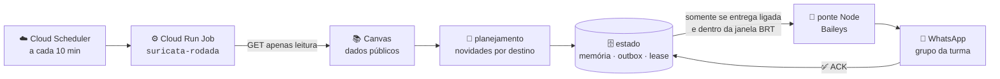
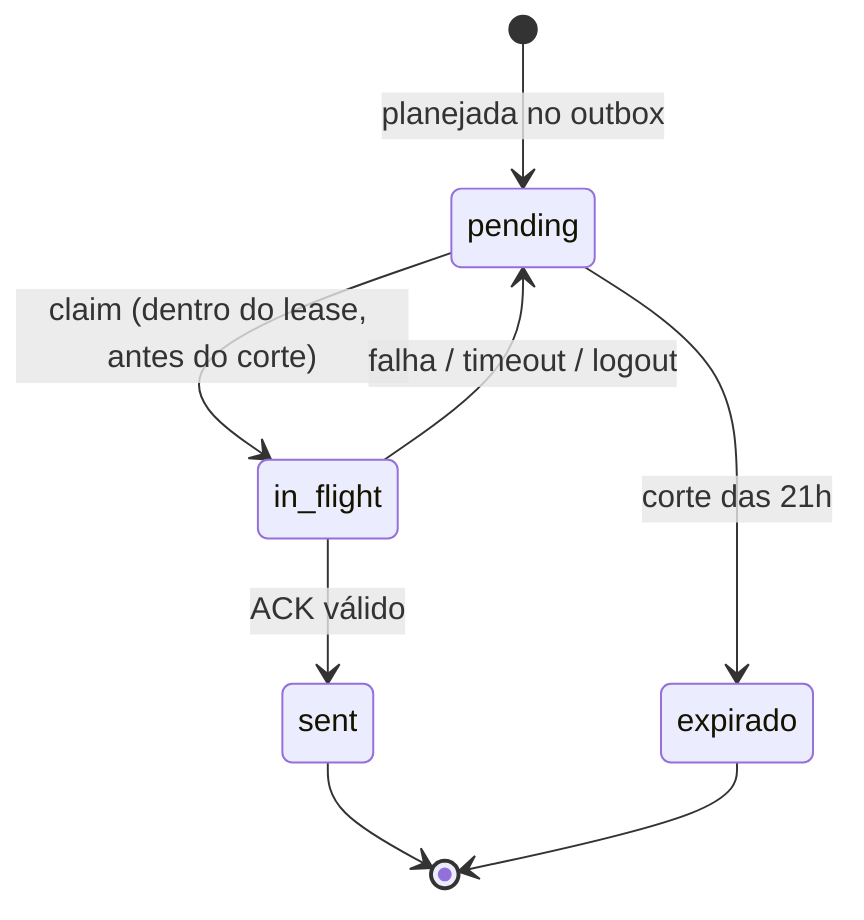

# Arquitetura — como a Suricata funciona por dentro

Uma frase antes dos diagramas: **Python é dono de todo o estado e de todo o
contrato; o Node só executa o envio.** Guarde isso e o resto do arquivo é
detalhe organizado.

## O fluxo de uma rodada

A cada 10 minutos, o Cloud Scheduler dispara um Cloud Run Job. O Job roda
`python -m suricata --mode rodada`, que percorre o caminho abaixo — do Canvas
ao ACK, sem atalhos:



Os passos em palavras:

1. **Coleta** — o bot consulta o Canvas com `GET` (nunca escreve lá) e
   normaliza as atividades públicas de cada oferta.
2. **Planejamento** — regras puras decidem, para cada destino, o que é
   novidade e vira aviso, com o texto final já pronto.
3. **Estado** — a novidade entra no outbox (`pending`), a memória registra o
   que já foi avisado e o lease trava a rodada para um executor por vez.
4. **Corte** — o relógio em `America/Sao_Paulo` é revalidado: depois das
   21:00, nada é reivindicado nem enviado.
5. **Entrega** — se (e só se) `SURICATA_ENTREGA=ligada` e a janela estiver
   aberta, a ponte Node envia a mensagem e devolve o ACK do servidor.
6. **Confirmação** — sem ACK válido, a mensagem não vira `sent`.

O corte das 21:00 é absoluto: um evento novo que aparece às 20:55 pode sair;
às 21:05, espera o amanhecer. Acordar por Scheduler não autoriza envio nenhum.

## Por que existe um outbox

O problema clássico de "enviar mensagem" é o meio do caminho: o processo
enviou, crashou **antes** de marcar como enviado — e, ao reiniciar, envia de
novo. Duplicata no grupo. O outbox separa as duas decisões que costumam ser
uma só: "devo enviar isso" (gravada no estado, de forma durável, com um
`message_id` determinístico) e "enviei mesmo" (só após ACK). Como o
`message_id` é derivado do conteúdo, um reenvio após crash chega ao WhatsApp
com a mesma identidade e é detectado como duplicata, não como novidade.

## Por que CAS (compare-and-swap)

Duas rodadas nunca deveriam escrever no mesmo estado ao mesmo tempo — mas
equipamento reinicia, Scheduler dispara cedo, humano executa manualmente.
Toda escrita de estado carrega uma *geração* lida antes; gravar só funciona
se a geração não mudou. Se mudou, alguém escreveu no meio e a operação falha
fechado em vez de sobrescrever silenciosamente. É o mesmo mecanismo que
protege a sessão do WhatsApp (`auth.json`): materializada temporariamente,
persistida por CAS e read-back, nunca copiada para o repositório.

## Por que lease

O lease é a trava da rodada: antes de qualquer efeito, o executor pega o
lock `locks/rodada.lock` com prazo (padrão observado: 6 minutos, via
`SURICATA_LEASE_MINUTOS`). Sem lease, duas execuções simultâneas planejariam
sobre a mesma memória e enviariam em dobro. Com lease vencido (executor
morreu), a próxima rodada assume — payload ilegível é abandonado, nunca um
lease preso. O lease também serve de *fencing*: uma execução que perdeu a
trava não consegue gravar estado como se ainda a tivesse.

O contrato de vida de uma mensagem resume tudo isso:



`sent` só existe com ACK; falha devolve a mensagem ao ponto de partida, com o
mesmo `message_id` — por isso o reenvio nunca duplica. `sent` e `expirado`
são terminais.

## A fronteira Python → Node

A ponte é um subprocesso com contrato mínimo e verificável:

- Python envia **um lote JSON pelo stdin**;
- o Node (Baileys) envia as mensagens e responde **um JSON sanitizado pelo
  stdout** (resultado por `message_id`, com ACK);
- o Node **não tem estado de negócio**: não decide elegibilidade, não conhece
  o outbox, não persiste nada do domínio;
- stderr não carrega sessão, token, QR, JID nem payload pessoal;
- timeout, logout ou resposta inválida **nunca** são tratados como sucesso.

Esse contrato é testável sem rede: o stub offline
[`suricata/tests/fixtures/bridge_stub.mjs`](../suricata/tests/fixtures/bridge_stub.mjs)
lê um lote e devolve resultados com ACK, aceitando cenários (sucesso,
timeout, crash) pela variável `SURICATA_STUB_SCENARIO`. Os testes E2E usam
exatamente esse stub.

## Os três modos

| Modo | O que faz | Envia? |
|---|---|---:|
| `shadow` | Probe local: emite `{"mode":"shadow","status":"ok","adapter":"none"}` e termina. Zero-config, usada pelo CI e pelo Docker. | Não |
| `demo` | Rodada offline com fixtures congeladas e relógio fixo; planeja e imprime, sem Canvas/estado/entrega. | Não |
| `rodada` | Caminho canônico de produção: Canvas → planejamento → estado → entrega condicionada. | Só com os 3 gates |

O `Dockerfile` fixa `ENTRYPOINT ["python3", "-m", "suricata"]` e
`CMD ["--mode", "shadow"]` — um container sem sobrescrita apenas reporta
saúde. A configuração **não** tem arquivo: tudo vem do ambiente do processo
(ou do Secret Manager, que materializa o ambiente no Job). As variáveis e
suas semânticas estão em [`interno/CONFIGURATION.md`](interno/CONFIGURATION.md)
e no [`.env.example`](../.env.example) comentado.

## Mapa das pastas

```text
suricata/
├── __main__.py, entrypoint.py   porta de entrada e roteador CLI
├── demo.py                      rodada offline com fixtures
├── rodada/                       orquestração: compõe runtime, coleta, agenda manual, config
├── dominio/                      regras puras sem I/O: planejamento, calendário, textos, corte 21h
├── integracao/                   adaptadores de efeito externo: cliente Canvas e a ponte Node
├── storage/                      persistência e concorrência: outbox, lease, CAS, GCS/local
├── whatsapp/                     ponte Node/Baileys: parear, enviar, verificar (sem estado de negócio)
├── infra/                         inventário declarativo de isolamento
└── tests/                         suíte de contratos (pytest, unittest, node --test)
```

Uma linha por pasta, a regra de ouro: `dominio/` não conhece rede nem disco;
`integracao/` e `storage/` são as únicas áreas autorizadas a conhecer efeitos
externos; `rodada/` coordena sem assumir detalhes de Canvas, GCS ou
subprocesso.

## Fronteiras que não se cruzam

- **Canvas → domínio:** somente dados públicos; nunca `submission`, nota,
  quiz aberto ou tentativa iniciada.
- **Python → Node:** lote JSON por stdin, resposta por stdout, Node sem
  estado — como descrito acima.
- **Node → WhatsApp:** único efeito externo de mensagem; só ACK compatível
  autoriza `sent`.
- **Local → imagem:** o Docker copia o contexto `suricata/` e instala as
  dependências Node pelo lockfile; nada de `auth.json`, QR, sessão ou segredo.

## Limites de manutenção

1. A família legada (`sentinela`, `application`, `domain`, `adapter`,
   `estado`, `grupo`, `delivery`, lease legado, `notifiers/`, `legacy/`) foi
   removida em 2026-09-18, quando o CLI foi reduzido a
   `shadow`/`demo`/`rodada`. O histórico vive no git; não reintroduza esses
   módulos nem fachadas de compatibilidade.
2. `shadow`, `demo` e `rodada` são três contratos diferentes: não transforme
   `shadow` em alias funcional de `demo`.
3. Configuração é ambiente de processo; não crie arquivo de configuração.
4. Fail-closed é regra: falta de configuração, estado, lease ou ACK derruba a
   execução — nunca degrada para "sucesso".
5. CAS e outbox são contratos de concorrência: qualquer mudança neles exige
   prova de equivalência antes.
6. Teste verde offline prova o contrato local — não prova IAM, build, digest
   implantado, Canvas ao vivo ou entrega WhatsApp.

Os contratos exatos que uma refatoração deve preservar estão em
[`interno/CONTRACTS.md`](interno/CONTRACTS.md); o mapa módulo a módulo, em
[`interno/MAPA.md`](interno/MAPA.md). Para por onde começar na prática, o
tutorial é [`guia.md`](guia.md).
