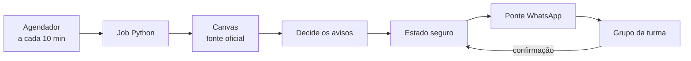
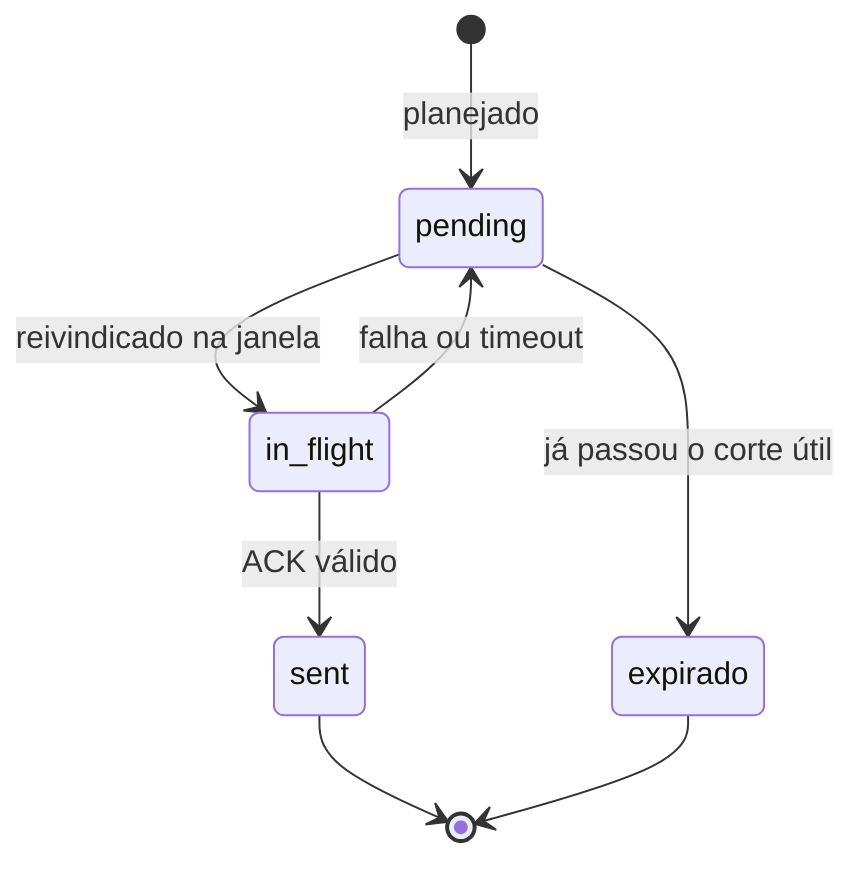

# Arquitetura — como a Suricata funciona

## A ideia em uma frase

A Suricata lê o Canvas, prepara lembretes para a turma e só tenta entregar uma mensagem quando as regras de horário, configuração, destino e confirmação permitem. **Python decide e guarda o estado; Node apenas conversa com o WhatsApp.**

O Canvas é a fonte oficial dos prazos e tipos. A agenda manual só complementa uma informação ausente; ela não corrige nem substitui o Canvas.

## O caminho completo, sem jargão

Na nuvem, um agendador acorda um job a cada 10 minutos. O job executa `python -m suricata --mode rodada`. Ele consulta o Canvas em modo somente leitura, monta os avisos, salva o que precisa ser lembrado e, quando todos os gates estão abertos, chama a ponte WhatsApp.



Acordar o job não autoriza envio. O horário de Brasília é aplicado dentro do job: 07:00 reabre a manhã, 12:00 permite o aviso extra de prova/quiz da véspera, 18:00 prepara o lembrete principal e 21:00 fecha o envio. Depois do corte, o item fica para uma janela posterior ou expira quando já não fizer sentido.

### Passo a passo

1. **Ler:** o cliente faz `GET` no Canvas e usa somente dados públicos das ofertas. Nunca busca notas, submissões, tentativas ou respostas.
2. **Classificar:** cada atividade vira prova, quiz ou tarefa conforme os dados do Canvas e regras explícitas de classificação.
3. **Planejar:** o domínio decide o que é novidade, o que já foi avisado e qual horário faz sentido. O texto final nasce aqui.
4. **Guardar:** o plano é colocado no estado local ou no bucket configurado. Isso permite retomar após uma queda sem esquecer o que estava pendente.
5. **Verificar:** a rodada precisa de uma trava de execução, configuração de entrega ligada, destino confirmado e janela BRT aberta.
6. **Entregar:** Python manda um lote para Node. Node envia ao WhatsApp e devolve uma confirmação sanitizada.
7. **Confirmar:** só uma confirmação válida transforma o item em `sent`. Timeout, logout ou resposta inválida não viram sucesso.

## As regras visíveis para estudantes

- **Prova:** aviso extra pode sair às 12:00 da véspera; o lembrete geral pode sair às 18:00.
- **Quiz:** segue a mesma lógica e pode receber lembrete perto da abertura quando for um quiz curto.
- **Tarefa:** o aviso usa a data de entrega e pode aparecer no lembrete da véspera ou com antecedência para atividades relevantes.
- **Agenda manual:** é uma entrada complementar (`agenda/manual.json`). Um item de prova/quiz não duplica o que o Canvas já registra no mesmo curso e dia.
- **Silêncio:** nada é reivindicado ou enviado a partir de 21:00. A manhã começa às 07:00.

Essas regras são políticas do planejador, não garantias de que todo item será anunciado. Coleta parcial, falta de data, duplicidade e falta de contexto podem resultar em silêncio; nesses casos, o Canvas deve ser consultado.

## A parte técnica, explicada

Esta seção define os mecanismos que protegem o estado. Eles não são necessários para o primeiro contato, mas são contratos de manutenção.

### ACK: confirmação de entrega

ACK é a confirmação devolvida pelo servidor do WhatsApp depois que a ponte tenta enviar. A Suricata não marca `sent` só porque o subprocesso terminou sem erro. Sem ACK compatível, permanece pendente ou volta a ser tentado conforme o contrato.

### Outbox: fila durável

O outbox separa “decidi enviar” de “o servidor confirmou”. Cada item pendente tem um `message_id` determinístico. Se o processo cair entre o envio e o registro, a retomada reconhece a mesma identidade em vez de criar uma novidade silenciosa.



`sent` e `expirado` são estados finais. O corte noturno não é um envio atrasado: ele impede a reivindicação naquele horário.

### CAS: não sobrescrever trabalho concorrente

CAS (*compare-and-swap*) significa “grave somente se a versão ainda for a que li”. Toda escrita carrega uma geração. Se outra rodada gravou antes, a geração mudou e a operação falha fechada, em vez de apagar silenciosamente a atualização alheia. O mesmo cuidado vale para a sessão WhatsApp temporária, que nunca deve ir para o repositório.

### Lease: uma rodada por vez

Lease é uma trava com prazo em `locks/rodada.lock`. O executor precisa adquiri-la antes de produzir efeitos. Se morrer, o prazo permite que uma rodada futura assuma; se perder a trava, não pode gravar como se ainda fosse dona. O valor padrão observado é de 6 minutos, ajustável por `SURICATA_LEASE_MINUTOS`.

## Contrato Python → Node

A ponte é um subprocesso pequeno:

- Python envia um lote JSON pelo `stdin`;
- Node usa Baileys para enviar e responde JSON sanitizado no `stdout`, por `message_id`;
- Node não decide elegibilidade, não conhece o outbox e não persiste estado de negócio;
- `stderr` não recebe sessão, token, QR, JID ou payload pessoal;
- timeout, logout e resposta inválida nunca significam sucesso.

O stub offline [`suricata/tests/fixtures/bridge_stub.mjs`](../suricata/tests/fixtures/bridge_stub.mjs) exercita esse formato nos testes sem rede. Isso prova o contrato local da ponte, não a entrega de uma conta real.

## Os três modos

| Modo | Uso | Efeito externo |
|---|---|---|
| `shadow` | Verificar que o pacote responde. | Nenhum. |
| `demo` | Mostrar o planejamento com fixture e relógio fixos. | Nenhum; mensagens são planejadas, não enviadas. |
| `rodada` | Caminho de produção: Canvas, planejamento, estado e entrega condicionada. | Só com todos os gates. |

A fixture da demo contém dados sintéticos. Exemplos e relatórios da demo são **saída esperada**, não “saída real” do Canvas ou do WhatsApp.

## Fluxo cloud e configuração

O Cloud Scheduler dispara o Cloud Run Job. O job recebe configuração do ambiente do processo (em produção, materializada pelo Secret Manager), executa a rodada e termina. O `Dockerfile` usa `python3 -m suricata` com `shadow` como padrão; um container sem sobrescrita apenas reporta saúde.

O armazenamento pode ser um diretório local quando `SURICATA_ESTADO_URI` não usa `gs://`, ou um bucket quando usa `gs://`. O Docker não deve conter `auth.json`, QR, sessão ou segredo. O procedimento de publicação está em [`deploy-gcp.md`](deploy-gcp.md); as variáveis e seus significados estão em [`interno/CONFIGURATION.md`](interno/CONFIGURATION.md) e [`.env.example`](../.env.example).

## Mapa das pastas

```text
suricata/
├── __main__.py, entrypoint.py   entrada e roteador CLI
├── demo.py                      rodada offline com fixtures
├── rodada/                      coordenação, coleta e agenda manual
├── dominio/                     regras sem rede nem disco
├── integracao/                  Canvas e ponte para efeitos externos
├── storage/                     estado, outbox, lease, CAS e GCS/local
├── whatsapp/                    ponte Node/Baileys e pareamento
├── infra/                       isolamento declarativo
└── tests/                       contratos Python e Node
```

A regra de ownership é simples: `dominio/` não conhece rede nem disco; `integracao/` e `storage/` concentram efeitos; `rodada/` coordena sem assumir detalhes de Canvas, GCS ou subprocesso.

## Limites de manutenção

1. `shadow`, `demo` e `rodada` são contratos diferentes; não transforme um no outro.
2. Configuração vem do ambiente do processo; não crie um arquivo de configuração alternativo.
3. Fail-closed é obrigatório: falta de configuração, estado, lease ou ACK não pode virar sucesso.
4. Canvas fornece a fonte oficial. A agenda manual é complementar e não deve duplicar prova/quiz já presente.
5. Não reintroduza a família legada removida (`sentinela`, `application`, `domain`, `adapter`, `estado`, `grupo`, `delivery`, `notifiers/` e `legacy/`) nem fachadas de compatibilidade sem contrato explícito.
6. Teste verde offline não prova IAM, build, digest implantado, Canvas ao vivo, sessão ou entrega WhatsApp.

Os contratos exatos estão em [`interno/CONTRACTS.md`](interno/CONTRACTS.md); o mapa módulo a módulo, em [`interno/MAPA.md`](interno/MAPA.md). O tutorial de uso é [`guia.md`](guia.md).
