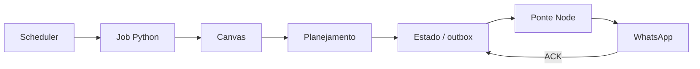

# Arquitetura

A Suricata lê dados coletivos do Canvas, planeja avisos, persiste o que precisa ser lembrado e só chama o WhatsApp quando configuração, destino, horário e confirmação permitem.



## Fluxo

1. Python consulta o Canvas em modo somente leitura.
2. O domínio classifica prova, quiz e tarefa.
3. O planejador decide novidade, janela e texto.
4. Estado, lease e outbox protegem retomada e idempotência.
5. Python envia um lote JSON para Node.
6. Node conversa com WhatsApp e devolve confirmação sanitizada.
7. Só ACK compatível transforma um item em `sent`.

Coleta incompleta, timeout, logout, configuração ausente ou ACK inválido falham fechados.

## Regras de horário

O relógio é `America/Sao_Paulo`: 07:00 reabre, 12:00 permite aviso extra, 18:00 prepara o lembrete principal e 21:00 fecha a janela. O processo pode ser acordado a cada 10 minutos sem enviar nada.

## Estado e entrega

- **Lease:** permite uma rodada por vez.
- **CAS:** impede sobrescrever uma geração alterada por outra rodada.
- **Outbox:** separa item planejado de item confirmado.
- **ACK:** confirmação técnica; sem ela não há sucesso.
- **message_id:** identidade determinística para evitar duplicidade.

## Modos

| Modo | Efeito |
|---|---|
| `shadow` | verifica o entrypoint, sem rede ou estado persistente |
| `demo` | usa fixture fictícia e não envia |
| `rodada` | usa Canvas, estado e entrega condicionada |

## Organização do código

```text
suricata/
├── dominio/       regras sem rede nem disco
├── rodada/        coordenação e planejamento
├── integracao/    Canvas e efeitos externos
├── storage/       estado, outbox, lease, CAS e GCS/local
├── whatsapp/      ponte Node e pareamento
└── tests/         contratos Python e Node
```

O domínio não conhece rede nem disco. Integração e storage concentram efeitos. A rodada coordena sem assumir detalhes dos adaptadores.

Consulte [`configuracao.md`](configuracao.md) para variáveis e [`deploy-gcp.md`](deploy-gcp.md) para o procedimento autorizado de deploy.
