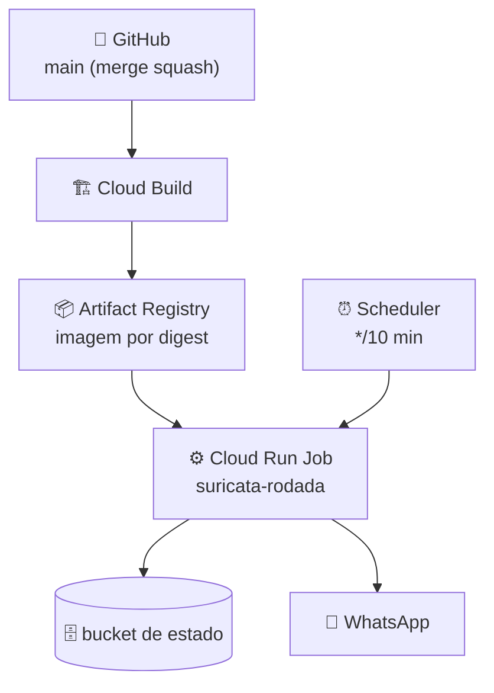

# Deploy no Google Cloud — para humanos

> **Snapshot de 2026-09-17/18.** Tudo que este arquivo descreve sobre a nuvem
> foi lido por read-back naquela data. Nomes de projeto, Job, Scheduler e
> digest mudam; **sempre faça read-back antes de agir** — nenhum texto
> (inclusive este) substitui a leitura do recurso real.

## O que existe lá hoje

A produção é propositalmente pequena: **um** Cloud Run Job acionado por
**um** Scheduler, uma imagem por digest, um bucket de estado. Na região
`southamerica-east1`, projeto `suricata-college-20260913`:

| Recurso | Nome observado (read-back) | Papel |
|---|---|---|
| Cloud Run Job | `suricata-rodada` | roda `python -m suricata --mode rodada` |
| Scheduler | `suricata-rodada-10min` | `*/10 * * * *`, timezone `America/Sao_Paulo`, `ENABLED` |
| Job canário | `suricata-canario-prod` | mesma imagem, entrega desligada, estado separado |
| Artifact Registry | `southamerica-east1-docker.pkg.dev/suricata-college-20260913/suricata/suricata` | imagem por digest |
| Bucket de estado | `gs://suricata-college-20260913-estado/` | memória, outbox, lease, sessão (via CAS) |



O caminho de uma mudança é sempre o mesmo: merge na `main` → build com
digest registrado → canário sem entrega → corte controlado → observação.
Rollback é apontar o Job de volta para o digest anterior.

### Pré-requisitos na sua máquina

- **`gcloud` CLI (Google Cloud SDK)** — a única ferramenta obrigatória para deploy (o build da imagem é remoto, no Cloud Build). Instale pelo instalador oficial: https://cloud.google.com/sdk/docs/install (no Windows, `winget install Google.CloudSDK` também funciona). Depois: `gcloud init`, `gcloud auth login` e `gcloud config set project <projeto-suricata>`.
- **Docker local** — **opcional**. Como o build roda no Cloud Build, você só precisa de Docker se quiser testar a imagem na sua máquina antes (ex.: `docker run --rm <imagem> --mode demo`).
- **Git + acesso ao repo** e a sessão WhatsApp em produção (fora do escopo do deploy; veja o guia).

Antes de qualquer passo de nuvem:

- `gcloud` instalado e logado no projeto Suricata — **não** no projeto do Bot
  pessoal do Telegram;
- suíte local verde na máquina que vai construir (`python -m compileall -q
  suricata && python -m pytest -q` e os testes Node);
- Docker local OU Cloud Build disponível (o que usar, registre qual foi);
- autorização explícita para qualquer comando com efeito — build e update
  não são "testes".

E confirme os nomes por read-back antes de usá-los — nunca copie daqui sem
conferir (o plano histórico chega a mencionar `suricata-sentinela`, que não
é o nome atual):

```bash
PROJECT="suricata-college-20260913"
REGION="southamerica-east1"

gcloud projects describe "$PROJECT" --format='yaml(projectId,lifecycleState)' --quiet
gcloud run jobs list --region "$REGION" --project "$PROJECT" \
  --format='table(name,latestCreatedExecution,startTime,completionTime)' --quiet
gcloud scheduler jobs list --location "$REGION" --project "$PROJECT" \
  --format='table(name,state,schedule,timeZone)' --quiet
gcloud artifacts repositories list --location "$REGION" --project "$PROJECT" \
  --format='table(name,format)' --quiet
gcloud storage ls "gs://${PROJECT}-estado/" --project "$PROJECT"
```

Para um Job encontrado no read-back, descreva sem executar:

```bash
gcloud run jobs describe NOME_CONFIRMADO --region "$REGION" --project "$PROJECT" \
  --format='yaml(name,template.template.containers,template.template.timeout,template.template.maxRetries)' --quiet
```

## Passo 1 — Build por digest

Registre a origem antes de construir — commit e árvore limpa:

```bash
git rev-parse HEAD
git status --short
```

Construa a imagem identificada pelo commit (comando do runbook/estado
atual; preencha projeto e registry **com os valores do read-back**, nunca de
memória):

```bash
gcloud builds submit . \
  --project=<projeto-suricata-confirmado> \
  --tag=<artifact-registry-suricata-confirmado>/suricata:<commit-curto>
```

Depois do build, confirme: status `SUCCESS`; imagem contém somente os
artefatos esperados (nenhum `auth.json`, `.wa-auth`, QR, token ou banco);
digest completo registrado em [`interno/STATUS.md`](interno/STATUS.md);
commit e digest associados.

**Sem digest verificado, não há deploy.** Ponto.

## Passo 2 — Canário sem entrega

O canário (`suricata-canario-prod`) existe para validar o caminho real na
nuvem **sem risco de mensagem**: estado separado, nenhum destino real,
`SURICATA_ENTREGA=desligada` e `maxRetries=0`.

1. Atualize **somente o Job canário** para o digest novo (ação com efeito —
   exige autorização): imagem por digest, `--mode rodada`,
   `SURICATA_ENTREGA=desligada`, `maxRetries=0`, timeout 300s, estado
   separado, service account Suricata, **sem** `SURICATA_GRUPO_JID` ou
   `SURICATA_DESTINOS_JSON`.
2. Execute **apenas o canário** — nunca o Job de produção, nunca um envio real.
3. Leia a execução e os logs sanitizados: exigiu-se zero eventos enviados,
   zero ACK de entrega, nenhum segredo ou destino pessoal.
4. Faça read-back da imagem/digest/args/env do canário. Qualquer divergência
   do planejado: pare e corrija o registro.

Canário `Succeeded` prova que o Job roda na nuvem — **não** prova entrega
WhatsApp (que continua desligada).

## Passo 3 — Corte controlado

O corte troca o digest do Job de produção. Exige autorização explícita
**separada** do canário. Antes: CI verde, clone limpo verde, imagem por
digest, canário aprovado, rollback preparado (digest anterior anotado),
exatamente um Scheduler, destino confirmado por procedimento autorizado.

1. **Registre o digest anterior** — é o seu rollback.
2. Atualize **somente o Job** de produção (`suricata-rodada`) para o digest
   novo. Nada mais: sem criar Scheduler novo, sem alterar frequência,
   secrets ou IAM.
3. Faça read-back de imagem, args, env, timeout, retries e service account
   do Job atualizado — o sucesso do comando não prova que o estado desejado
   foi aplicado.
4. Observe uma execução completa. `Succeeded` significa execução, não
   entrega; o que confirma entrega são os contadores `sent`/ACK no relatório
   — e entrega só liga quando o gate humano autorizar.
5. Registre o resultado e a janela de observação em
   [`interno/STATUS.md`](interno/STATUS.md).

## Rollback

Aponte o Job de produção de volta para o **digest anterior conhecido**, faça
read-back de imagem/args/env/retries/timeout, preserve o estado (não apague
nada para "limpar") e observe a próxima execução. Não reescreva histórico, não
delete objetos do bucket, não recrie recursos do zero.

## O que NUNCA fazer

- **Nunca crie um segundo Scheduler.** Existe exatamente um
  (`suricata-rodada-10min`). Dois Schedulers = duas rodadas simultâneas =
  mensagens duplicadas. Achou um segundo? Parar e reconciliar antes de tudo.
- **Nunca aplique um digest sem read-back** — nem o seu, nem o de rollback.
  Confirme a imagem, args, env e service account **depois** de atualizar.
- **Nunca trate `Succeeded` como "mensagem entregue"** — sem `sent`/ACK no
  relatório, houve execução, não entrega.
- **Nunca ligue `SURICATA_ENTREGA` fora de um corte autorizado**, e nunca
  como parte de "validação" ou diagnóstico.
- **Nunca use `gcloud run jobs update`, `gcloud scheduler jobs update`,
  `gcloud run jobs execute` ou `gcloud builds submit` como "teste"** sem
  autorização própria para aquele efeito.
- **Nunca apague ou sobrescreva estado do bucket para "resolver" um
  problema** — o outbox e a memória são a fonte da idempotência.
- **Nunca copie sessão, `auth.json` ou QR** para o repo, para a imagem ou
  para o log.

## Estado da última execução observada (referência, não verdade)

Última rodada observada por read-back: coletou 10 ofertas e 36 atividades,
`eventos=[]`, contadores de entrega zerados (entrega desligada na época).
Detalhes e datas exatas: [`interno/STATUS.md`](interno/STATUS.md). Se este
parágrafo e o read-back de agora divergirem, o read-back vence.
