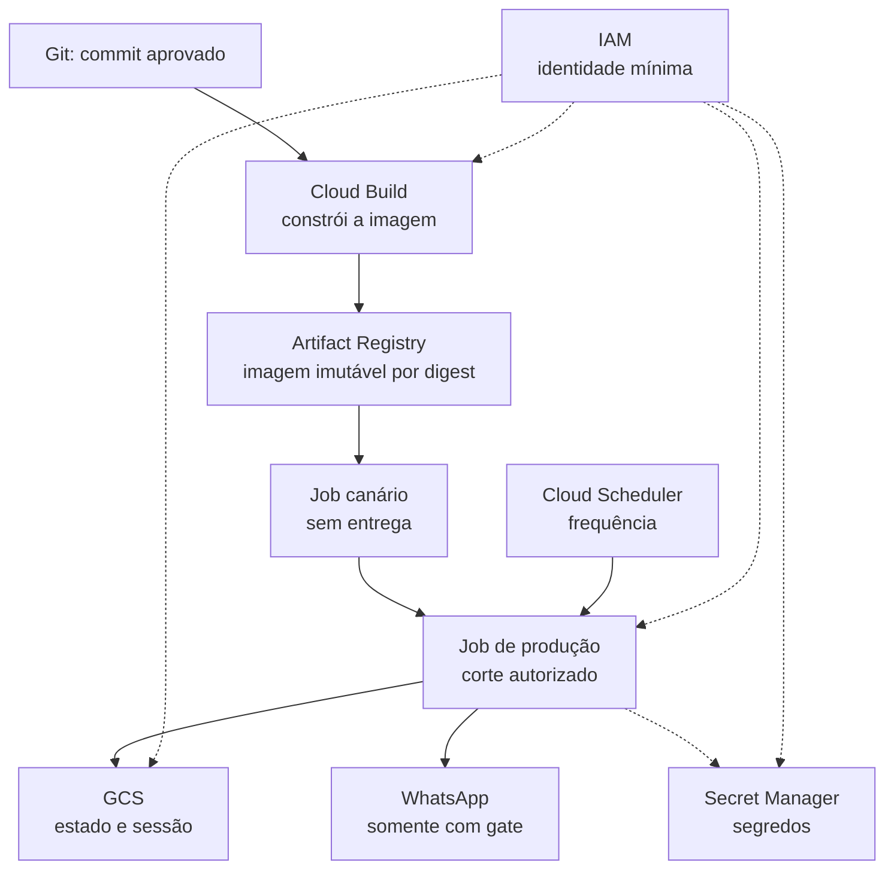

# Deploy no Google Cloud — guia público

Este documento explica o desenho e os gates de deploy sem publicar nomes de
projeto, buckets, Jobs, Schedulers, contas de serviço, JIDs, digests ou IDs de
build. Os valores entre `<ângulos>` são preenchidos somente por um operador
autorizado, depois de um read-back do ambiente real.

> **Escopo:** este é um procedimento público e sanitizado. Ele não é um
> inventário da produção. Nunca transforme os placeholders deste arquivo em
> valores reais dentro de um commit.

## O que acontece

Uma mudança aprovada segue este caminho:



- **Cloud Build** executa o build remoto a partir do checkout; Docker local é
  opcional.
- **Artifact Registry** guarda a imagem produzida. O Job recebe um **digest**,
  não uma tag mutável.
- **Cloud Run Job** executa uma rodada finita de Python; ele não é um servidor
  HTTP sempre ligado.
- **Cloud Scheduler** apenas dispara o Job na frequência aprovada. Acordar o
  processo não autoriza uma entrega.
- **GCS** guarda estado, lease, outbox e, quando configurado, a sessão em um
  namespace separado e autorizado. O estado é parte da idempotência; não deve
  ser apagado para “limpar” uma falha.
- **Secret Manager** fornece segredos ao runtime sem colocá-los em Git, argv,
  imagem ou logs. No mínimo, o token do Canvas deve seguir esse caminho.
- **IAM** define qual identidade pode construir, ler segredos, executar o Job e
  ler/gravar somente os buckets necessários. Use contas de serviço distintas
  quando a separação de build, canário e produção exigir isso.

## Custos: o que pode gerar cobrança

Os valores dependem da região, volume e contrato da conta; consulte a tabela de
preços antes de aprovar o deploy. O mapa de cobrança é:

| Serviço | O que pode custar | Como reduzir surpresa |
|---|---|---|
| Cloud Build | tempo de máquina e artefatos/logs conforme a cota e configuração | builds sob demanda, contexto mínimo e retenção de logs definida |
| Artifact Registry | armazenamento das imagens e operações/transferência aplicáveis | manter apenas tags/digests necessários e política de retenção |
| Cloud Run Jobs | CPU, memória, duração e execuções do Job | timeout, retries e frequência pequenos e explícitos |
| Cloud Scheduler | número de jobs e invocações além das cotas aplicáveis | um Scheduler por rotina; conferir frequência e região |
| Cloud Storage (GCS) | armazenamento, operações, retenção e rede | namespace separado, lifecycle consciente e nunca apagar CAS sem plano |
| Secret Manager | versões armazenadas, acessos e operações além das cotas aplicáveis | acessar somente no runtime autorizado; não duplicar secrets |
| IAM | normalmente não há uma linha de cobrança pelo controle de acesso | aplicar menor privilégio; custos indiretos podem vir de auditoria/logs |

Referências oficiais: [Cloud Build pricing](https://cloud.google.com/build/pricing),
[Artifact Registry pricing](https://cloud.google.com/artifact-registry/pricing),
[Cloud Run pricing](https://cloud.google.com/run/pricing),
[Cloud Scheduler pricing](https://cloud.google.com/scheduler/pricing),
[Cloud Storage pricing](https://cloud.google.com/storage/pricing) e
[Secret Manager pricing](https://cloud.google.com/secret-manager/pricing).

## Pré-requisitos e variáveis do operador

- `gcloud` CLI instalado e autenticado com a conta autorizada: [instalação
  oficial](https://cloud.google.com/sdk/docs/install).
- Git e acesso ao repositório.
- CI local verde antes de qualquer mutação: `python -m compileall -q
  suricata`, `python -m pytest -q` e os testes Node descritos em
  [`configuracao.md`](configuracao.md).
- Docker local **não é obrigatório**; só é necessário para testar uma imagem
  localmente antes do build remoto.
- Autorização explícita para cada ação com efeito. Build, execução de canário,
  update do Job e mudança de Scheduler não são testes inofensivos.

Use variáveis de shell sem valores persistentes no histórico:

```bash
PROJECT="<projeto-confirmado>"
REGION="<regiao-confirmada>"
JOB_CANARY="<job-canario-confirmado>"
JOB_PROD="<job-producao-confirmado>"
SCHEDULER="<scheduler-confirmado>"
REPOSITORY="<url-artifact-registry-confirmada>"
STATE_URI="gs://<bucket-confirmado>/<prefixo-autorizado>"
```

Os placeholders acima não são valores sugeridos. Antes de qualquer update,
faça read-back do recurso exato:

```bash
gcloud projects describe "$PROJECT" \
  --format='yaml(projectId,lifecycleState)' --quiet

gcloud run jobs list --region "$REGION" --project "$PROJECT" \
  --format='table(name,latestCreatedExecution)' --quiet

gcloud scheduler jobs list --location "$REGION" --project "$PROJECT" \
  --format='table(name,state,schedule,timeZone)' --quiet

gcloud artifacts repositories list --location "$REGION" --project "$PROJECT" \
  --format='table(name,format)' --quiet

gcloud storage ls "$STATE_URI/" --project "$PROJECT"
```

Se o read-back mostrar recurso ausente, duplicado ou pertencente ao projeto
errado, pare. Não crie um recurso “parecido” para seguir o tutorial.

## Gate 0 — origem e validação

1. Confirme que o checkout é o commit aprovado e que não há mudanças locais:

   ```bash
   git rev-parse HEAD
   git status --short
   ```

2. Registre o commit e a pessoa autorizadora no sistema operacional privado,
   não neste documento público.
3. Verifique que nenhum segredo, sessão WhatsApp, QR, JID, token, dump ou
   banco está no contexto de build.
4. Confirme que a configuração do canário usa estado separado, entrega
   desligada, nenhum destino real e retries limitados.

## Gate 1 — build remoto e digest

O Cloud Build recebe o contexto do repositório, constrói a imagem e publica no
Artifact Registry. Um exemplo sanitizado:

```bash
gcloud builds submit . \
  --project="$PROJECT" \
  --tag="$REPOSITORY/suricata:<commit-curto>"
```

Depois, o operador deve conferir no console ou CLI que o build terminou com
sucesso, que a imagem não contém credenciais e que o digest completo foi
registrado no controle privado de mudanças. **Sem digest lido de volta não há
update de Job.** Tags são apenas conveniência humana; o deploy usa o digest.

## Gate 2 — canário sem entrega

O canário valida imagem, dependências, acesso autorizado ao estado e leitura de
segredos sem enviar WhatsApp.

1. Atualize somente `<job-canario-confirmado>` para o digest candidato, com
   `--mode rodada`, `SURICATA_ENTREGA=desligada`, estado separado, ausência de
   `SURICATA_GRUPO_JID` e `SURICATA_DESTINOS_JSON`, timeout e retries explícitos.
2. Execute somente o canário, após autorização específica.
3. Leia execução e logs sanitizados: erro de configuração deve ser visível,
   mas nunca o valor do segredo, sessão ou destino.
4. Faça read-back de imagem, args, env não secreto, timeout, retries, identidade
   e namespace de estado.

`Succeeded` prova que o Job executou. Não prova coleta completa, destino
correto, autenticação do WhatsApp nem entrega; com `SURICATA_ENTREGA=desligada`,
entrega deve permanecer fora do caminho.

## Gate 3 — corte controlado

O corte produtivo é uma aprovação separada do canário. Antes de executá-lo,
confirme: CI verde, clone limpo, digest candidato conhecido, canário aprovado,
digest anterior anotado para rollback, exatamente um Scheduler e destino
confirmado por procedimento privado.

1. Registre o digest anterior.
2. Atualize somente `<job-producao-confirmado>` para o digest candidato. Não
   crie Scheduler, não mude frequência, IAM, secrets ou bucket como parte do
   corte.
3. Faça read-back de imagem, args, env, timeout, retries e identidade.
4. Observe uma execução completa e registre o resultado no controle privado.
   Execução bem-sucedida não equivale a mensagem entregue; entrega exige os
   sinais de confirmação previstos no contrato e autorização explícita.
5. Se qualquer read-back divergir do esperado, pare antes da próxima execução.

## Rollback

Rollback é voltar o Job ao **digest anterior conhecido**, não reconstruir a
imagem nem apagar estado:

```bash
# Preencha somente com valores confirmados no procedimento privado.
PREVIOUS_DIGEST="sha256:<digest-anterior-confirmado>"
# Use o comando de update aprovado pelo operador e pela política local.
```

Após o update, leia de volta imagem, args, env, timeout, retries, identidade e
estado. Preserve GCS, outbox, lease e histórico para que a idempotência e a
investigação não sejam destruídas. Se o problema for segredo, IAM ou Scheduler,
trate essa causa separadamente; não “resolva” apagando recursos.

## Proibições

- Não publique ou copie para este repositório projetos, buckets, JIDs, digests,
  IDs de build, nomes de Jobs, nomes de Scheduler, contas de serviço ou tokens.
- Não crie um segundo Scheduler para compensar uma falha; duas frequências podem
  duplicar rodadas e mensagens.
- Não use `Succeeded` como sinônimo de entrega.
- Não ligue `SURICATA_ENTREGA` durante diagnóstico ou canário.
- Não coloque segredos em argv, Dockerfile, imagem, `.env` versionado ou log.
- Não execute `gcloud run jobs execute`, `gcloud run jobs update`,
  `gcloud scheduler jobs update` ou `gcloud builds submit` sem autorização
  própria para o efeito.
- Não faça deploy a partir de árvore suja nem aceite digest sem read-back.

Este arquivo descreve o método. O estado real, valores preenchidos e evidências
operacionais pertencem a um controle privado e não são fonte pública.
